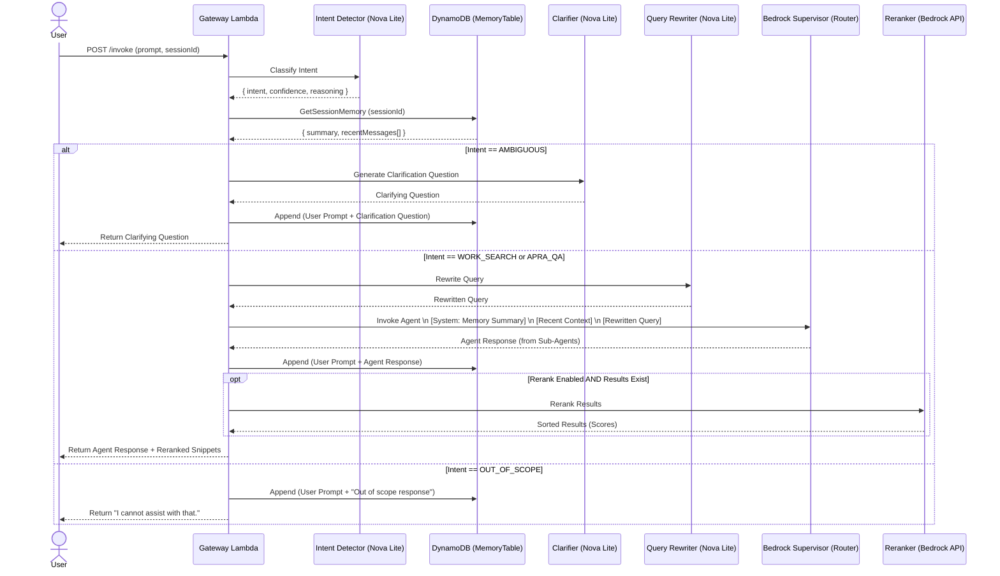

# aws-bedrock-multiagents

A pnpm workspace monorepo for an AWS Bedrock multi-agent system managed with CDK.

The repository currently includes:

- CDK infrastructure for Bedrock Agents, Guardrails, IAM, and Lambda wiring
- A `work_search` Lambda tool
- A Python `rag_search` Lambda tool (`apps/rag-service/lambda_tool.py`)
- A shared package for Bedrock action types, observability helpers, and OpenAPI schemas
- Workspace-wide type checking with `tsgo`
- Workspace-wide linting with `oxlint`
- Workspace-wide formatting with `prettier`

## Architecture

### Gateway Request Flow

The architecture routes all requests through the `tool-supervisor` Lambda, which acts as a Gateway. It handles LLM-based intent classification, DynamoDB memory, standard Bedrock agent routing, and optional Bedrock reranking.



### Bedrock Resources

- `work-search-agent`
- `apra-qa-agent`
- `supervisor-agent`

It also provisions:

- two Lambda functions used as Bedrock action group executors
- two Guardrails with different strictness levels
- IAM roles that allow Bedrock agents to invoke models and Lambdas
- CloudWatch Log Groups for the tool Lambdas

The supervisor agent is configured as a `SUPERVISOR_ROUTER` and routes requests to the specialist agents.

## Repository Layout

```text
.
├── apps
│   └── rag-service
│       ├── app
│       ├── lambda_tool.py
│       ├── pyproject.toml
│       └── uv.lock
├── package.json
├── pnpm-workspace.yaml
├── tsconfig.base.json
└── packages
    ├── infra-cdk
    │   ├── bin/app.ts
    │   └── lib
    │       ├── bedrock-agents-stack.ts
    │       ├── monitoring-ec2-stack.ts
    │       └── neo4j-data-stack.ts
    ├── shared
    │   └── src
    │       ├── bedrockActionTypes.ts
    │       ├── observability.ts
    │       └── openapi
    └── tool-work-search
        └── src
            ├── handler.ts
            └── mcpClient.ts
```

## Packages

### `packages/infra-cdk`

CDK app and stack definitions.

Key file:

- `packages/infra-cdk/lib/bedrock-agents-stack.ts`
- `packages/infra-cdk/lib/monitoring-ec2-stack.ts`
- `packages/infra-cdk/lib/neo4j-data-stack.ts`

Responsibilities:

- define a standalone Neo4j data stack (`Neo4jDataStack`) with EC2 + EBS + Secrets Manager
- define a standalone monitoring stack (`MonitoringEc2Stack`) with EC2 + Grafana + CloudWatch data source
- define Bedrock Guardrails
- define Bedrock Agents and aliases
- define Lambda functions for action groups
- load shared OpenAPI schemas
- package Lambda `dist/` directories as CDK assets

### `packages/tool-work-search`

Lambda for the `work_search` action group.

Current status:

- wired with Powertools tracer/logger/metrics
- returns stubbed MCP-backed work search results
- needs a real MCP transport implementation in `src/mcpClient.ts`

### `apps/rag-service`

Python runtime for hybrid RAG and the current `rag_search` Bedrock action executor.

Current status:

- FastAPI retrieval endpoint (`/retrieve`) for local dev
- Lambda handler (`lambda_tool.py`) used by CDK `RagSearchFn`
- Hybrid retrieval: OpenSearch BM25 (sparse) + pgvector (dense) fused via RRF
- LightRAG-inspired keyword extraction (dual-level: high-level themes + low-level entities)
- LLM reranking with Qwen scoring, token-budget awareness, and graceful fallback
- Structured evidence prompts for grounded answer synthesis
- Feature flags for progressive rollout (`RAG_ENABLE_KEYWORD_EXTRACTION`, `RAG_ENABLE_RERANKING`)

### `packages/tool-rag-search` (legacy)

Legacy Node implementation kept for reference; no longer the default `rag_search` executor in CDK.

### `packages/shared`

Shared workspace package for:

- Bedrock action request/response types
- response helpers
- observability helpers
- OpenAPI schemas used by CDK

## Tooling

### Type Checking

Primary type checking uses `tsgo`.

```bash
pnpm typecheck
```

Fallback `tsc` type checking is also available:

```bash
pnpm typecheck:tsc
```

### Linting

Linting uses `oxlint` with rules tuned for this Node/CDK/Lambda codebase.

```bash
pnpm lint
pnpm lint:fix
```

### Formatting

Formatting uses `prettier`.

```bash
pnpm format:check
pnpm format
```

## Build and Deploy

Install dependencies:

```bash
pnpm install
```

Build all workspace packages:

```bash
pnpm build
```

Synthesize the CDK app:

```bash
pnpm synth
```

## Python Hybrid RAG Service

The repository now includes a Python runtime scaffold at `apps/rag-service` for the hybrid retrieval path.

Install Python dependencies:

```bash
pnpm rag:install
```

Start locally:

```bash
pnpm rag:dev
```

API endpoints:

- `GET /healthz`
- `POST /retrieve` (sparse mode by default, hybrid if `query_embedding` is provided)

The retrieval response includes strict citation fields (`url`, `year`, `month`, and locator fields).

Bedrock `rag_search` action workflow (current 9-node LangGraph pipeline):

```text
detect_intent → extract_keywords → rewrite_query → build_request → retrieve → rerank → build_citations → choose_model → generate_answer
```

1. **Lambda entry**: `apps/rag-service/lambda_tool.py`
2. **Action adapter**: `apps/rag-service/app/bedrock_action.py`
3. **LangGraph orchestration**: `apps/rag-service/app/workflow.py`
4. **Intent detection**: classify complexity (Qwen preferred, heuristic fallback)
5. **Keyword extraction** _(Phase 1 — LightRAG)_: dual-level keyword extraction (high-level themes + low-level entities) for entity-aware query expansion
6. **Query rewrite**: retrieval-optimized rewrite with keyword context (Qwen preferred, pass-through fallback)
7. **Hybrid retrieval**: OpenSearch BM25 sparse + pgvector dense, fused via weighted RRF
8. **LLM reranking** _(Phaßse 1 — LightRAG)_: Qwen-based relevance scoring with token-budget awareness and graceful fallback
9. **Model routing**: `Nova Lite` default, `Qwen Plus` fßor complex/low-confidence cases
10. **Answer synthesis**: structured evidence prompts with Bedrock `converse` or Qwen DashScope

### LightRAG Migration Roadmap

This project is progressively porting techniques from [LightRAG (EMNLP 2025)](https://github.com/hkuds/lightrag) into the RAG pipeline. The full 3-phase plan is documented in [`docs/lightrag-migration-plan.md`](docs/lightrag-migration-plan.md).

| Phase                                      | Status      | Description                                                                                     |
| ------------------------------------------ | ----------- | ----------------------------------------------------------------------------------------------- |
| **Phase 1**: Query Enhancement + Reranking | ✅ Complete | Keyword extraction, entity-aware query expansion, LLM reranking, structured evidence prompts    |
| **Phase 2**: Knowledge Graph Construction  | 🔲 Planned  | Entity/relation extraction with Qwen Plus, Neo4j graph storage, incremental ingestion pipeline  |
| **Phase 3**: Graph-Enhanced Retrieval      | 🔲 Planned  | Multi-mode search (naive + local + global + hybrid), graph-aware reranking, community summaries |

Diff the stack:

```bash
pnpm diff
```

Bootstrap the target AWS environment if needed:

```bash
pnpm bootstrap
```

Deploy:

```bash
pnpm deploy:data   # Neo4j data layer only
pnpm deploy:monitoring # Grafana (CloudWatch datasource) on dedicated EC2
pnpm deploy:app    # application layer only
```

`Neo4jDataStack` defaults:

- `instanceType=t3.micro` (free-tier-friendly default)
- `rootVolumeSizeGiB=8`
- `volumeSizeGiB=20`
- `allowedIngressCidr=0.0.0.0/0` (lock this down for non-PoC environments)
- `retainDataOnDelete=true` (EBS volume + Neo4j secret are retained on stack delete)

`MonitoringEc2Stack` defaults:

- `instanceType=t3.micro`
- `rootVolumeSizeGiB=8`
- `allowedIngressCidr=0.0.0.0/0` (lock this down for non-PoC environments)
- `retainDataOnDelete=true` (Grafana admin secret is retained on stack delete)

Override Neo4j sizing/networking with CDK context:

```bash
pnpm deploy:data -- \
  --context neo4jInstanceType=t3.large \
  --context neo4jRootVolumeSizeGiB=16 \
  --context neo4jVolumeSizeGiB=100 \
  --context neo4jAllowedIngressCidr=1.2.3.4/32 \
  --context neo4jRetainDataOnDelete=true
```

Override monitoring sizing/networking with CDK context:

```bash
pnpm deploy:monitoring -- \
  --context monitoringInstanceType=t3.micro \
  --context monitoringRootVolumeSizeGiB=8 \
  --context monitoringAllowedIngressCidr=1.2.3.4/32 \
  --context monitoringRetainDataOnDelete=true
```

Start/stop Neo4j and Grafana EC2 instances quickly:

```bash
pnpm instance:status
pnpm instance:stop:neo4j
pnpm instance:start:neo4j
pnpm instance:stop:grafana
pnpm instance:start:grafana
pnpm instance:stop:all
pnpm instance:start:all
```

If your account only allows specific free-tier instance types, switch explicitly (example):

```bash
pnpm deploy:data -- --context neo4jInstanceType=t2.micro
```

Destroy only the application layer (keep Neo4j data stack):

```bash
pnpm destroy:app
```

Destroy only the data layer:

```bash
pnpm destroy:data
```

Destroy only the monitoring layer:

```bash
pnpm destroy:monitoring
```

If you want `destroy:data` to also delete EBS + secret, deploy with:

```bash
pnpm deploy:data -- --context neo4jRetainDataOnDelete=false
```

Deploy or destroy all stacks together:

```bash
pnpm deploy:all
pnpm destroy:all
```

Important: `packages/infra-cdk` deploys Lambda code from the built `dist/` folders in the tool packages. Run `pnpm build` before `pnpm synth`, `pnpm diff`, or deployment commands.

## Environment Variables

An example environment file is included at `.env.example`.

Important:

- this repository does not auto-load `.env` files with `dotenv`
- CDK and the AWS SDK read credentials and region from your shell environment or AWS config
- prefer `AWS_PROFILE` or AWS SSO over long-lived access keys

Recommended local setup:

```bash
export AWS_PROFILE=default
export AWS_DEFAULT_REGION=ap-southeast-2
```

If you are using static credentials locally instead:

```bash
export AWS_ACCESS_KEY_ID="replace-me"
export AWS_SECRET_ACCESS_KEY="replace-me"
export AWS_DEFAULT_REGION="ap-southeast-2"
```

If your credentials are temporary, also set:

```bash
export AWS_SESSION_TOKEN="replace-me"
```

### Variables That Matter Right Now

- `AWS_PROFILE`
  - preferred way to select your AWS identity locally
- `AWS_DEFAULT_REGION`
  - used by AWS tooling and should match your deployment region
- `AWS_ACCESS_KEY_ID`
  - optional if you use static credentials instead of a profile
- `AWS_SECRET_ACCESS_KEY`
  - optional if you use static credentials instead of a profile
- `AWS_SESSION_TOKEN`
  - required only for temporary credentials

### What CDK Uses

The CDK app sets the stack environment from:

- `CDK_DEFAULT_ACCOUNT`
- `CDK_DEFAULT_REGION`

These are normally resolved automatically by CDK from your active AWS credentials and region. You usually do not need to export `CDK_DEFAULT_ACCOUNT` yourself.

### Variables You May Add Later

These are useful project-level settings, but they are not all wired into the code yet:

- `FOUNDATION_MODEL_ID`
  - useful if you want to stop hardcoding the Bedrock model ID in the CDK stack
- `WORK_SEARCH_ENDPOINT`
  - likely needed when `packages/tool-work-search/src/mcpClient.ts` is replaced with a real MCP or HTTP call
- `RAG_BACKEND_ENDPOINT`
  - likely needed when `packages/tool-rag-search/src/ragClient.ts` is replaced with a real RAG backend

### RAG Service Feature Flags

These flags control Phase 1 (LightRAG) features in `apps/rag-service`:

- `RAG_ENABLE_KEYWORD_EXTRACTION` (default: `true`)
  - enable dual-level keyword extraction before query rewrite
- `RAG_ENABLE_RERANKING` (default: `true`)
  - enable LLM-based reranking of retrieval results
- `RAG_RERANK_CANDIDATE_COUNT` (default: `20`)
  - number of candidates to retrieve before reranking
- `RAG_RERANK_MAX_TOKENS` (default: `30000`)
  - token budget for reranking context window

See `apps/rag-service/README.md` for the full list of `RAG_*` / `QWEN_*` variables.

### Verify Your AWS Identity

Before running CDK commands, verify that the active identity and region are correct:

```bash
aws sts get-caller-identity
aws configure list
```

## Development Workflow

Recommended local workflow:

```bash
pnpm install
pnpm typecheck
pnpm lint
pnpm build
pnpm synth
```

If you are actively editing code:

```bash
pnpm format
pnpm lint:fix
pnpm typecheck
```

## Bedrock-Specific Notes

### Foundation Model

The CDK stack currently uses this placeholder model ID:

```text
amazon.nova-lite-v1:0
```

Update it in:

- `packages/infra-cdk/lib/bedrock-agents-stack.ts`

### Shared OpenAPI Schemas

The action group schemas are stored in:

- `packages/shared/src/openapi/work-search.yaml`
- `packages/shared/src/openapi/rag-search.yaml`

These are loaded by the CDK stack at synth/deploy time.

### Tool Lambda Packaging

Both tool Lambdas are bundled with `esbuild` and emitted to `dist/` as single-file CommonJS output for the Lambda runtime.

Useful build commands:

- `pnpm build`
  - build every workspace package
- `pnpm build:lambdas`
  - rebuild only the two tool Lambda bundles
- `pnpm build:infra`
  - rebuild only the CDK app output under `packages/infra-cdk/dist`

## Git Hooks

Git hooks are configured with `husky`.

After `pnpm install`, the `prepare` script enables the repository hooks automatically.

Hook behavior:

- `pre-commit`
  - runs `lint-staged`
  - formats staged files with `prettier`
  - runs `oxlint --fix` on staged JavaScript and TypeScript files
- `pre-push`
  - runs `pnpm check`
  - this executes `pnpm typecheck`, `pnpm lint`, and `pnpm format:check`

## What Still Needs Real Implementation

The repository is scaffolded and type-checked, but some parts are still placeholders:

- `packages/tool-work-search/src/mcpClient.ts`
  - replace the stub with a real MCP call
- `packages/tool-rag-search/src/ragClient.ts`
  - replace the stub with your real RAG workflow
- `packages/infra-cdk/lib/bedrock-agents-stack.ts`
  - verify Bedrock resource properties against your AWS account, region, and final model choices

## AWS Prerequisites

Before deployment, make sure:

- your AWS credentials are configured locally
- `AWS_PROFILE` or AWS credentials resolve to the intended AWS account
- `AWS_DEFAULT_REGION` matches your target deployment region

## Test Client

A TypeScript CLI test client is included at `scripts/test-agent.ts`.

Install dependencies first:

```bash
pnpm install
```

Invoke an agent by alias ARN:

```bash
pnpm test:agent -- \
  --alias-arn arn:aws:bedrock:ap-southeast-2:123456789012:agent-alias/AGENT_ID/ALIAS_ID \
  --prompt "who is APRA AMCOS"
```

Or use a named shortcut after exporting the matching alias ARN:

```bash
pnpm test:agent -- --agent supervisor --prompt "who is APRA AMCOS"
pnpm test:agent -- --agent qa --prompt "who is APRA AMCOS"
pnpm test:agent -- --agent work --prompt "find a work titled Hello by Adele"
```

Show a condensed trace summary in the terminal:

```bash
pnpm test:agent -- \
  --agent supervisor \
  --prompt "who is APRA AMCOS" \
  --trace-summary
```

The terminal summary is rendered as a colored overview plus timeline, with route conclusion, action-group results, final answer, step type, relative timing, collaborator hops, and selected details such as model usage and failures.

Enable trace output and save the full response as JSON:

```bash
pnpm test:agent -- \
  --alias-arn arn:aws:bedrock:ap-southeast-2:123456789012:agent-alias/AGENT_ID/ALIAS_ID \
  --prompt "who is APRA AMCOS" \
  --trace \
  --output tmp/apra-who-is.json \
  --json
```

You can also pass IDs directly:

```bash
pnpm test:agent -- \
  --agent-id SHWNEKC9MO \
  --alias-id 8VQRTZW7A6 \
  --prompt "who is APRA AMCOS"
```

Supported environment variables:

- `BEDROCK_SUPERVISOR_ALIAS_ARN`
- `BEDROCK_SUPERVISOR_AGENT_ID`
- `BEDROCK_SUPERVISOR_ALIAS_ID`
- `BEDROCK_QA_ALIAS_ARN`
- `BEDROCK_QA_AGENT_ID`
- `BEDROCK_QA_ALIAS_ID`
- `BEDROCK_WORK_ALIAS_ARN`
- `BEDROCK_WORK_AGENT_ID`
- `BEDROCK_WORK_ALIAS_ID`
- `BEDROCK_AGENT_ALIAS_ARN`
- `BEDROCK_AGENT_ID`
- `BEDROCK_AGENT_ALIAS_ID`
- `BEDROCK_AGENT_REGION`
- `BEDROCK_AGENT_SESSION_ID`
- `CDK_DEFAULT_ACCOUNT` and `CDK_DEFAULT_REGION` resolve correctly
- the target region supports the Bedrock resources and foundation model you plan to use
- your account has the required Bedrock and Lambda permissions

## Test Gateway (Conversational Memory)

We provide a script to test the **Gateway Lambda**, which orchestrates intent detection, custom DynamoDB memory, Bedrock Agent invocations, and result reranking.

Invoke the gateway with a prompt. The gateway automatically detects intent (e.g., `WORK_SEARCH`, `APRA_QA`, `AMBIGUOUS`):

```bash
pnpm test:gateway -- --prompt "who is APRA AMCOS"
```

### Testing Multi-Turn Memory

The Gateway supports LLM-based rolling memory. To test multi-turn conversations, provide the same `--session-id` across requests:

**Turn 1 (Ambiguous Intent):**

```bash
pnpm test:gateway -- --session-id "my-test-session-123" --prompt "I need help with my song"
```

_The intent detector should classify this as `AMBIGUOUS` and immediately return a clarifying question without calling Bedrock agents._

**Turn 2 (Follow-up Context):**

```bash
pnpm test:gateway -- --session-id "my-test-session-123" --prompt "Yes, I am looking for Bohemian Rhapsody"
```

_The gateway fetches "I need help with my song" from DynamoDB, realizes you are doing a `WORK_SEARCH`, rewrites the query, and invokes the underlying agent._

## Evaluator Runner

A batch evaluator runner is included at `scripts/eval-agent.ts`.

Example input dataset:

- `scripts/examples/agent-eval.example.jsonl`

Run it against a named agent:

```bash
pnpm eval:agent -- \
  --agent supervisor \
  --input scripts/examples/agent-eval.example.jsonl \
  --output tmp/evals/supervisor.jsonl
```

Useful options:

- `--trace-summary`
  - prints the condensed trace summary for each row while the run is in progress
- `--format json`
  - writes one JSON array instead of JSONL
- `--output-format ragas`
  - writes a RAGAS-shaped dataset with `user_input`, `response`, `reference`, and optional context hints
- `--shared-session`
  - reuses one Bedrock session across all rows
- `--fail-fast`
  - aborts on the first failing example

Output records include:

- `prompt`
- `question`
- `answer`
- `reference`
- `ground_truth`
- `traceSummary`
- `traces`
- `metadata`

This shape is intended to be easy to transform into a later RAGAS evaluation dataset.

If you want a directly RAGAS-shaped output:

```bash
pnpm eval:agent -- \
  --agent supervisor \
  --input scripts/examples/agent-eval.example.jsonl \
  --output tmp/evals/supervisor-ragas.jsonl \
  --output-format ragas
```

## RAGAS Evaluation

RAGAS support is included via `scripts/ragas_eval.py`. It consumes the output from `pnpm eval:agent -- --output-format ragas` and runs evaluator metrics against Bedrock-hosted judge models.

Recommended setup:

```bash
python3 -m venv .venv
source .venv/bin/activate
pip install -r requirements-ragas.txt
```

Set evaluator models in `.envrc` or pass them on the command line:

```bash
export RAGAS_EVAL_LLM_MODEL="anthropic.claude-3-5-haiku-20241022-v1:0"
export RAGAS_EVAL_EMBEDDING_MODEL="amazon.titan-embed-text-v2:0"
```

Typical flow:

```bash
pnpm eval:agent -- \
  --agent supervisor \
  --input scripts/examples/agent-eval.example.jsonl \
  --output tmp/evals/supervisor-ragas.jsonl \
  --output-format ragas

pnpm eval:ragas -- \
  --input tmp/evals/supervisor-ragas.jsonl \
  --output tmp/evals/supervisor-ragas-results.json
```

You can override the evaluator models explicitly:

```bash
pnpm eval:ragas -- \
  --input tmp/evals/supervisor-ragas.jsonl \
  --output tmp/evals/supervisor-ragas-results.json \
  --llm-model anthropic.claude-3-5-haiku-20241022-v1:0 \
  --embedding-model amazon.titan-embed-text-v2:0
```

The runner auto-selects metrics from the fields present in every row:

- `response_relevancy`
  - requires `user_input` and `response`
- `factual_correctness`
  - requires `user_input`, `response`, and `reference`
- `semantic_similarity`
  - requires `response` and `reference`
- `faithfulness`
  - requires `user_input`, `response`, and `retrieved_contexts`
- `context_recall`
  - requires `user_input`, `reference`, and `retrieved_contexts`

Default metric selection is category-aware when `--metrics` is omitted:

- `qa`
  - defaults to `semantic_similarity,factual_correctness`
- `work-search`
  - defaults to `semantic_similarity`
- other categories
  - fall back to all metrics whose required fields are present

You can also force a metric subset:

```bash
pnpm eval:ragas -- \
  --input tmp/evals/supervisor-ragas.jsonl \
  --output tmp/evals/supervisor-ragas-results.json \
  --metrics response_relevancy,factual_correctness
```

By default the RAGAS runner groups rows by `category` before scoring. `eval-agent -- --output-format ragas` preserves `metadata.category` as a top-level `category`, so QA and work-search examples do not have to share one metric set.

If you want the old single-batch behavior:

```bash
pnpm eval:ragas -- \
  --input tmp/evals/supervisor-ragas.jsonl \
  --output tmp/evals/supervisor-ragas-results.json \
  --group-by none
```

The results file contains:

- evaluator config
- `group_by` and per-group results under `groups`
- selected metrics per group
- metric averages per group under `summary_by_group`
- per-metric exceptions per group under `metric_failures_by_group`
- per-row RAGAS scores under `rows`

## Work Search Rule Evaluation

`work-search` examples are usually not a good fit for generic RAGAS metrics because they often return clarification questions or structured match results instead of freeform grounded answers.

A separate rule-based evaluator is included at `scripts/eval-work-search.ts`.

Supported rule location:

- `metadata.work_search_eval`
- `metadata.workSearchEval`

Supported rules:

- `expected_mode`
  - `clarify` or `match`
- `expected_title_contains`
- `expected_writer_contains`
- `expected_winfkey`
- `require_prompt_title_echo`
- `require_prompt_writer_echo`
- `require_winfkey_for_match`
- `require_prompt_overlap`
- `required_substrings`
- `forbidden_substrings`

Default automatic checks:

- `clarify` mode
  - expects a clarification-style response
  - echoes extracted prompt title when available
  - echoes extracted prompt writer when available
- `match` mode
  - expects a non-clarification response
  - requires a `WINF...` identifier unless `expected_winfkey` or `require_winfkey_for_match: false` says otherwise
- all work-search rows
  - require some lexical overlap with the original prompt unless `require_prompt_overlap: false`

Example dataset entry:

```json
{
  "id": "work-1",
  "prompt": "find a work titled Hello by Adele",
  "metadata": {
    "category": "work-search",
    "work_search_eval": {
      "expected_mode": "clarify",
      "expected_title_contains": ["Hello"],
      "expected_writer_contains": ["Adele"]
    }
  }
}
```

Typical flow:

```bash
pnpm eval:agent -- \
  --agent supervisor \
  --input scripts/examples/agent-eval.example.jsonl \
  --output tmp/evals/supervisor-native.jsonl

pnpm eval:work-search -- \
  --input tmp/evals/supervisor-native.jsonl \
  --output tmp/evals/work-search-rules.json
```

The rule evaluator also works on ragas-shaped output as long as `metadata` is preserved.

## Useful Files

- `package.json`
- `packages/infra-cdk/bin/app.ts`
- `packages/infra-cdk/lib/bedrock-agents-stack.ts`
- `packages/shared/src/bedrockActionTypes.ts`
- `packages/shared/src/observability.ts`
- `packages/tool-work-search/src/handler.ts`
- `packages/tool-rag-search/src/handler.ts`
