# LightRAG Migration Plan

> Port [LightRAG](https://github.com/hkuds/lightrag) (EMNLP 2025) techniques into `apps/rag-service/`.
> Three phases: query enhancement → knowledge graph construction → graph-enhanced retrieval.

## 1. Current vs Target Architecture

### Current State

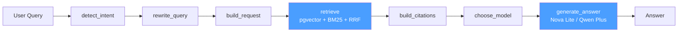

### Target State (Post Phase 3)

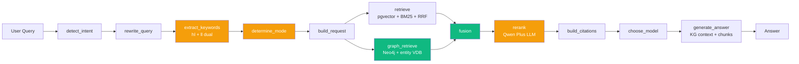

> Legend: 🟡 Phase 1 (query enhancement), 🟢 Phase 2-3 (graph retrieval)

## 2. Key Decisions

| Decision                | Choice                     | Rationale                                  |
| ----------------------- | -------------------------- | ------------------------------------------ |
| Entity extraction LLM   | Qwen Plus                  | Already integrated, good structured output |
| Ingestion mode          | Real-time (per upload)     | Simplicity; batch can be added later       |
| Starting phase          | Phase 1                    | Low risk, immediate value                  |
| Primary language        | English                    | Simplifies prompt design, can extend later |
| Graph storage           | Neo4j (existing CDK stack) | Already deployed, unused                   |
| Entity/relation vectors | pgvector (existing)        | No new infra, reuse embedding pipeline     |

## 3. Dependency Map

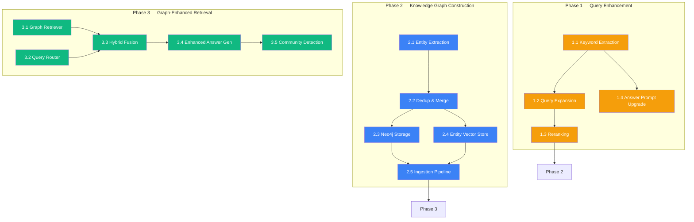

---

## Phase 1: Enhanced Query Understanding + Reranking

**Status**: ✅ Complete.

**Risk**: Low — query-side only, feature-flagged, zero storage changes.

### 1.1 Dual-Level Keyword Extraction

**What**: Replace single-pass intent detection with LightRAG-style dual keyword extraction.

**LightRAG reference**: `keywords_extraction` prompt → `{high_level_keywords: [...], low_level_keywords: [...]}`

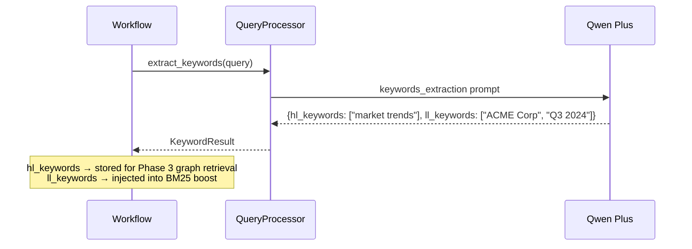

**File changes**:

| File                       | Change                                                              |
| -------------------------- | ------------------------------------------------------------------- |
| `query_processing.py`      | Add `extract_keywords()` method                                     |
| `models.py`                | Add `KeywordResult(hl_keywords: list[str], ll_keywords: list[str])` |
| `workflow.py`              | Add `extract_keywords` node after `rewrite_query`, extend State     |
| `config.py`                | Add `enable_keyword_extraction: bool = True`                        |
| `test_query_processing.py` | Test keyword JSON parsing, fallback on malformed output             |

**Implementation details**:

- Prompt adapted from LightRAG `keywords_extraction`, tuned for English
- JSON output with `_safe_json()` fallback (existing pattern)
- `ll_keywords` injected into OpenSearch `multi_match` as boosted terms
- `hl_keywords` stored in State for future graph retrieval (Phase 3)

### 1.2 Query Expansion

**What**: Enhance `rewrite_query` to incorporate keyword synonyms and expansions.

**File changes**:

| File                  | Change                                                          |
| --------------------- | --------------------------------------------------------------- |
| `query_processing.py` | Modify `rewrite_query()` to accept `ll_keywords`, expand prompt |
| `workflow.py`         | Update `rewrite_query` node to pass keywords                    |

**Implementation details**:

- Prompt upgrade: instruct LLM to incorporate synonyms/expansions of `ll_keywords`
- Output remains single-line rewritten query (backward compatible)
- Improves recall for abbreviations, acronyms, domain jargon

### 1.3 Retrieval Reranking

**What**: LLM-based reranking of retrieval results with token budget management.

**LightRAG reference**: `process_chunks_unified` — rerank + token budget control.

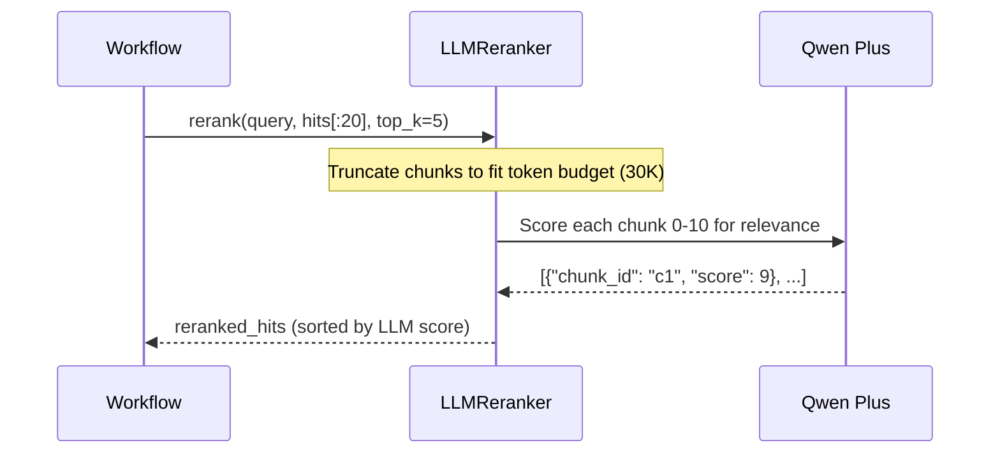

**File changes**:

| File               | Change                                                                                        |
| ------------------ | --------------------------------------------------------------------------------------------- |
| `reranker.py`      | **New** — `LLMReranker(settings, qwen_client)`                                                |
| `workflow.py`      | Add `rerank` node between `retrieve` and `build_citations`, extend State with `reranked_hits` |
| `config.py`        | Add `enable_reranking`, `rerank_candidate_count=20`, `rerank_max_tokens=30000`                |
| `test_reranker.py` | **New** — test scoring, budget truncation, error fallback                                     |

**Implementation details**:

- `LLMReranker.rerank(query, hits, top_k)`:
  1. Take top `rerank_candidate_count` hits from retrieval
  2. Truncate chunk text to fit within `rerank_max_tokens` budget
  3. Ask Qwen Plus to score each chunk 0-10 for query relevance
  4. Sort by LLM score, return top_k
- Fallback: if reranking fails, pass through original hits (graceful degradation)

### 1.4 Answer Prompt Upgrade

**What**: Restructure evidence block for future KG context injection.

**File changes**:

| File                  | Change                                            |
| --------------------- | ------------------------------------------------- |
| `answer_generator.py` | Upgrade evidence format, prepare KG context slots |

**Implementation details**:

- Current: flat evidence block `[N] title/url/snippet`
- Upgraded: structured sections (text_chunks now, entities + relations reserved for Phase 3)
- System prompt strengthened: explicit citation grounding, reasoning chain

### Phase 1 — Workflow After

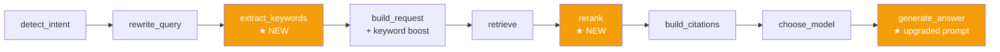

### Phase 1 — Feature Flags

| Flag                        | Default | Effect when OFF                           |
| --------------------------- | ------- | ----------------------------------------- |
| `enable_keyword_extraction` | `True`  | Skip keyword node, no BM25 boost          |
| `enable_reranking`          | `True`  | Pass retrieval hits directly to citations |

---

## Phase 2: Knowledge Graph Construction + Neo4j

**Status**: ✅ Complete.

**Risk**: Medium — new storage writes, but query pipeline untouched (feature-flagged).

### 2.1 Entity / Relation Extraction

**What**: LLM-powered extraction from document chunks, following LightRAG's structured output format.

**LightRAG reference**: `extract_entities` + `_process_extraction_result` + gleaning mechanism.

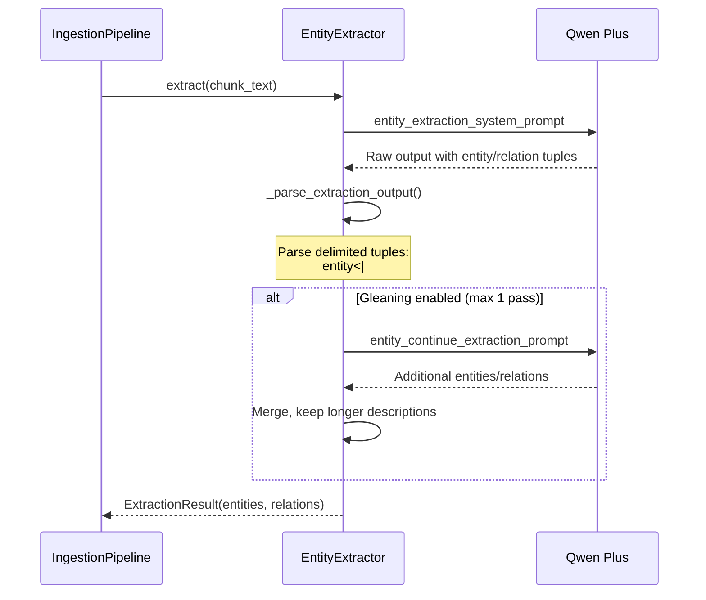

**File changes**:

| File                        | Change                                                                                      |
| --------------------------- | ------------------------------------------------------------------------------------------- |
| `entity_extraction.py`      | **New** — `EntityExtractor` class with extract + parse + glean                              |
| `prompts.py`                | **New** — centralized prompt templates (extraction, gleaning, summarize)                    |
| `models.py`                 | Add `Entity`, `Relation`, `ExtractionResult` dataclasses                                    |
| `config.py`                 | Add `enable_entity_extraction=False`, `entity_extract_max_gleaning=1`, `entity_types=[...]` |
| `test_entity_extraction.py` | **New** — parsing, gleaning, error recovery                                                 |

**Implementation details**:

- Output format: `entity<|#|>name<|#|>type<|#|>description` / `relation<|#|>source<|#|>target<|#|>keywords<|#|>description`
- Delimiter: `<|#|>` (tuple fields), `<|COMPLETE|>` (end marker)
- Gleaning: 1 extra pass with `entity_continue_extraction_user_prompt` to catch missed entities
- Parser: split by newlines + completion delimiter, validate field counts, skip malformed lines
- Entity types: `person, organization, location, event, concept, technology, document, regulation`

### 2.2 Entity Dedup & Description Merge

**What**: Merge duplicate entities across chunks with LLM-assisted description summarization.

**LightRAG reference**: `merge_nodes_and_edges` + `summarize_entity_descriptions`.

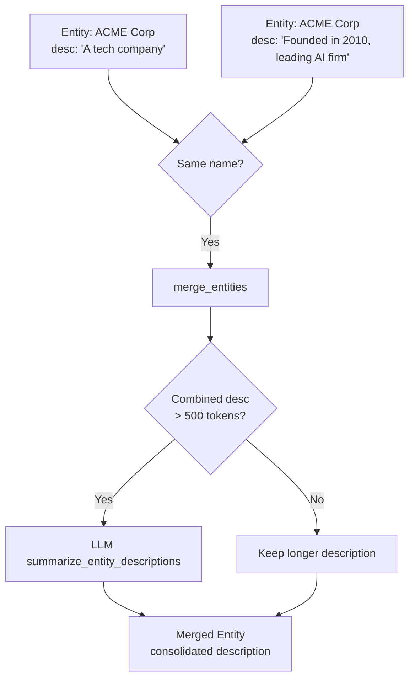

**File changes**:

| File                   | Change                                      |
| ---------------------- | ------------------------------------------- |
| `entity_extraction.py` | Add `merge_entities()`, `merge_relations()` |
| `config.py`            | Add `summary_max_tokens=500`                |

**Implementation details**:

- `merge_entities(existing, new)`: same-name → keep longer desc or LLM summarize if > `summary_max_tokens`
- `merge_relations(existing, new)`: same source+target → accumulate weight, merge descriptions
- Track `source_chunk_ids` through merges for provenance

### 2.3 Neo4j Storage Layer

**What**: Graph repository connecting to the existing CDK-deployed Neo4j instance.

**LightRAG reference**: `neo4j_impl.py` — schema, indexes, APOC traversal.

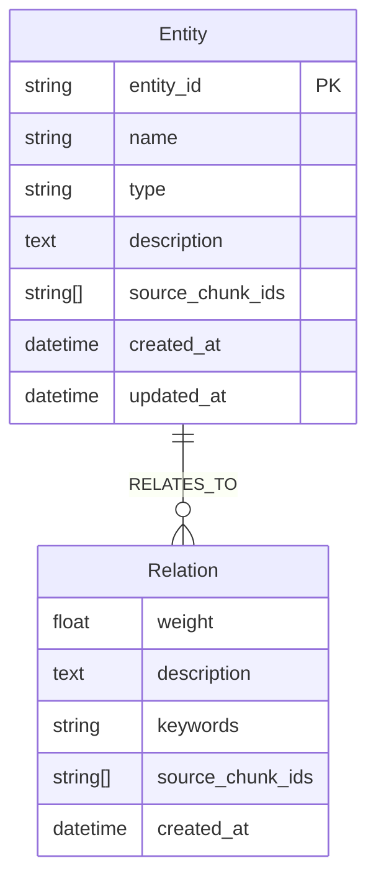

**File changes**:

| File                       | Change                                                                |
| -------------------------- | --------------------------------------------------------------------- |
| `graph_repository.py`      | **New** — `Neo4jRepository` with CRUD + traversal                     |
| `config.py`                | Add `neo4j_uri`, `neo4j_username`, `neo4j_password`, `neo4j_database` |
| `pyproject.toml`           | Add `neo4j` driver dependency                                         |
| `test_graph_repository.py` | **New** — mock-based unit tests                                       |

**Implementation details**:

- Write ops: `upsert_entity` (MERGE on name), `upsert_relation` (MERGE on src+tgt), `upsert_batch` (UNWIND)
- Read ops: `get_entity`, `get_entity_neighbors(depth=1)`, `get_relations_for_entities`, `search_entities_fulltext`
- Indexes: B-Tree on `entity_id`, Full-text on `name`
- Connection: lazy driver init, health check method
- Secrets: Neo4j password from AWS Secrets Manager (matching CDK stack)

### 2.4 Entity Vector Store

**What**: Store entity and relation embeddings in pgvector for semantic search.

**LightRAG reference**: `entities_vdb`, `relationships_vdb` — separate vector indexes.

**File changes**:

| File                     | Change                                             |
| ------------------------ | -------------------------------------------------- |
| `entity_vector_store.py` | **New** — `EntityVectorStore` with upsert + search |
| DB migration script      | **New** — `kb_entities` + `kb_relations` tables    |

**Schema**:

```sql
CREATE TABLE kb_entities (
    entity_id    TEXT PRIMARY KEY,
    name         TEXT NOT NULL,
    type         TEXT NOT NULL,
    description  TEXT,
    embedding    vector(1024),
    created_at   TIMESTAMPTZ DEFAULT now()
);

CREATE TABLE kb_relations (
    relation_id   TEXT PRIMARY KEY,
    source_name   TEXT NOT NULL,
    target_name   TEXT NOT NULL,
    keywords      TEXT,
    description   TEXT,
    embedding     vector(1024),
    created_at    TIMESTAMPTZ DEFAULT now()
);
```

**Implementation details**:

- Entity embedding: `embed(name + " " + type + " " + description)` via Qwen embedding
- Relation embedding: `embed(keywords + " " + description)` via Qwen embedding
- Search: pgvector cosine distance (`<=>`) with top_k

### 2.5 Ingestion Pipeline

**What**: Real-time document ingestion that extracts entities/relations and writes to graph + vector stores.

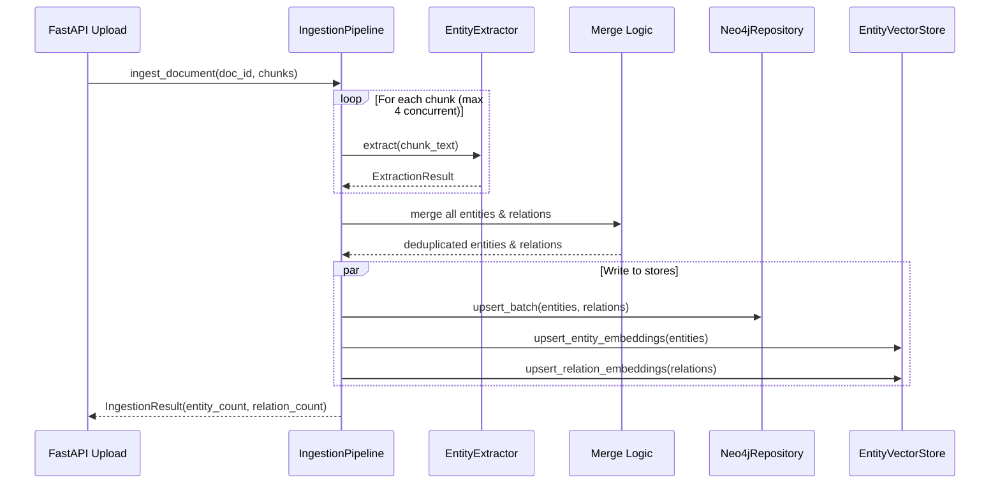

**File changes**:

| File                | Change                                     |
| ------------------- | ------------------------------------------ |
| `ingestion.py`      | **New** — `IngestionPipeline` orchestrator |
| `config.py`         | Add `ingestion_max_concurrent=4`           |
| `test_ingestion.py` | **New** — end-to-end with mocked services  |

**Implementation details**:

- `ingest_document(doc_id, chunks)`:
  1. `asyncio.gather` with semaphore (max 4 concurrent) per-chunk extraction
  2. Collect all entities + relations across chunks
  3. Dedup/merge pass
  4. Parallel write: Neo4j batch + pgvector batch
- Error handling: single chunk failure logged as warning, doesn't block others
- Integrated at document upload API endpoint

### Phase 2 — Data Flow

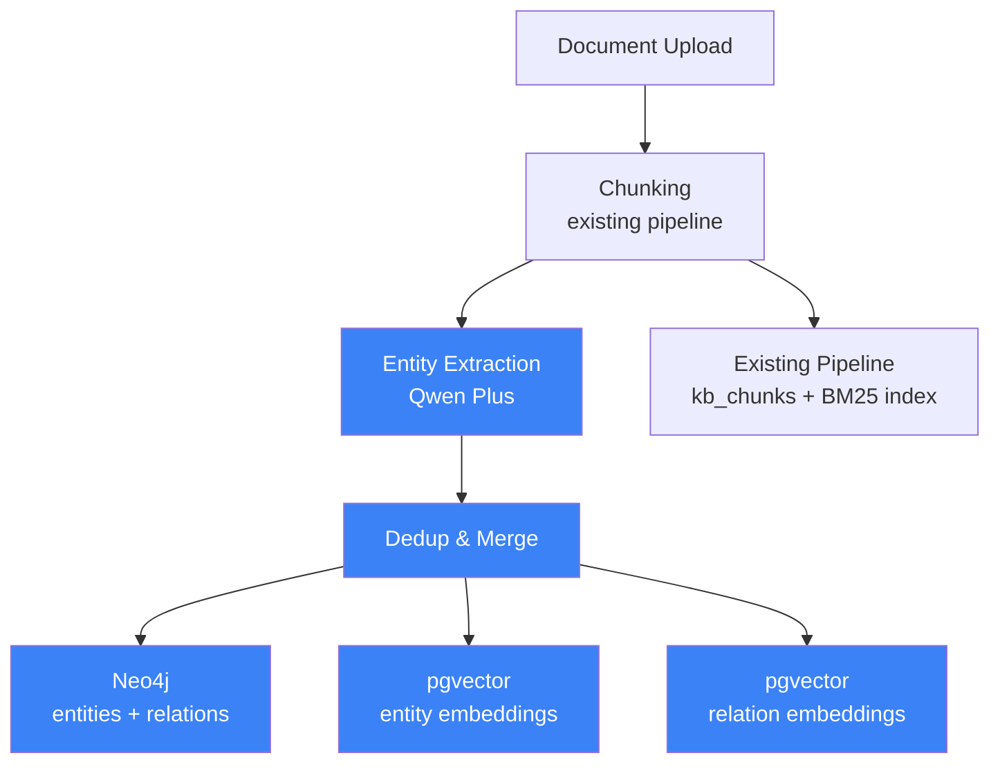

### Phase 2 — Completion Criteria

- [x] Document upload triggers entity/relation extraction
- [x] Entities and relations visible in Neo4j
- [x] Entity/relation embeddings in pgvector
- [x] Existing query pipeline completely unaffected
- [x] All new code behind `enable_entity_extraction` flag

---

## Phase 3: Graph-Enhanced Retrieval + Multi-Mode Search

**Status**: ✅ Complete (3.1–3.4). 3.5 Community Detection deferred.

**Risk**: Medium-high — modifies query pipeline, but feature-flagged with NAIVE fallback.

### 3.1 Graph Retriever

**What**: Query the knowledge graph using dual-level keywords from Phase 1.

**LightRAG reference**: `_build_query_context` — local/global/hybrid retrieval modes.

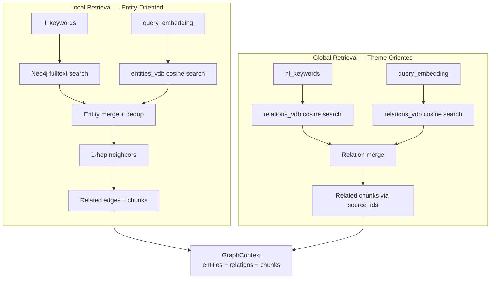

**File changes**:

| File                 | Change                                                      |
| -------------------- | ----------------------------------------------------------- |
| `graph_retriever.py` | **New** — `GraphRetriever` with local/global/hybrid methods |
| `models.py`          | Add `GraphContext`, `RetrievalMode` enum                    |

**Implementation details**:

- `retrieve_local(ll_keywords, query_embedding, top_k)`:
  1. Fulltext search Neo4j entities by `ll_keywords`
  2. Cosine search `kb_entities` by `query_embedding`
  3. Merge + dedup entity results
  4. For each entity: get 1-hop neighbors + relations from Neo4j
  5. Collect `source_chunk_ids` from relations → fetch original chunks
  6. Return `GraphContext(entities, relations, chunk_ids)`

- `retrieve_global(hl_keywords, query_embedding, top_k)`:
  1. Cosine search `kb_relations` by `query_embedding`
  2. Collect high-level relations matching `hl_keywords`
  3. Fetch related chunks via `source_chunk_ids`
  4. Return `GraphContext(entities, relations, chunk_ids)`

- `retrieve_hybrid`: union of local + global results
- Token budget: cap `entities_str + relations_str + chunks_str` per LightRAG defaults

### 3.2 Intelligent Query Router

**What**: Automatically select retrieval mode based on query characteristics.

**LightRAG reference**: 6 query modes (local/global/hybrid/naive/mix/bypass).

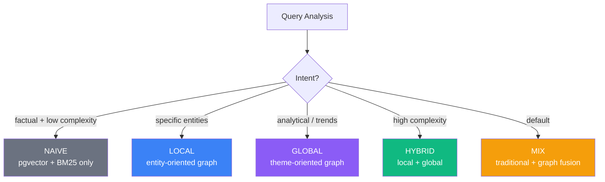

**File changes**:

| File                  | Change                                             |
| --------------------- | -------------------------------------------------- |
| `query_processing.py` | Add `determine_retrieval_mode()`                   |
| `workflow.py`         | Add `determine_mode` node after `extract_keywords` |

**Routing logic**:

| Mode     | Condition                                   | Retrieval Channels         |
| -------- | ------------------------------------------- | -------------------------- |
| `NAIVE`  | Low complexity + factual intent             | pgvector + BM25 (existing) |
| `LOCAL`  | Clear `ll_keywords`, entity-specific query  | Entity graph + existing    |
| `GLOBAL` | Analytical intent, `hl_keywords` dominant   | Relation graph + existing  |
| `HYBRID` | High complexity, both keyword types present | Local + Global + existing  |
| `MIX`    | Default / uncertain                         | All channels, RRF fusion   |

### 3.3 Hybrid Retrieval Fusion

**What**: Merge graph-based and traditional retrieval results.

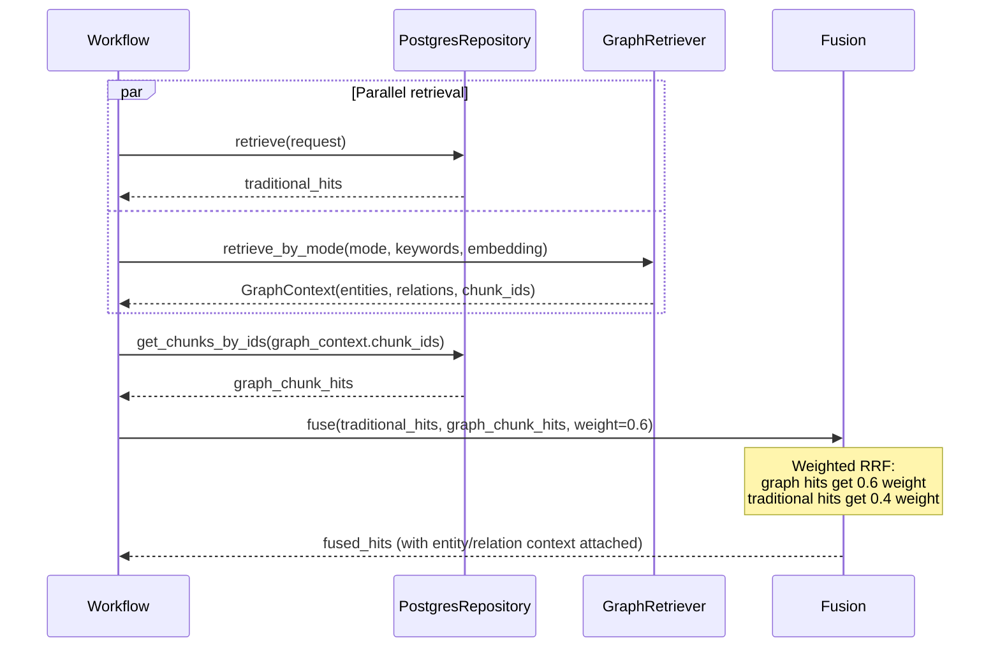

**File changes**:

| File            | Change                                                                                   |
| --------------- | ---------------------------------------------------------------------------------------- |
| `workflow.py`   | Modify `retrieve` node: parallel traditional + graph, add fusion                         |
| `repository.py` | Add `get_chunks_by_ids(chunk_ids)` method                                                |
| `config.py`     | Add `enable_graph_retrieval=False`, `graph_retrieval_weight=0.6`, `retrieval_mode="mix"` |

### 3.4 Enhanced Answer Generation

**What**: Feed KG context (entities + relations) alongside chunks into answer generation.

**LightRAG reference**: `rag_response` prompt + `kg_query_context` template.

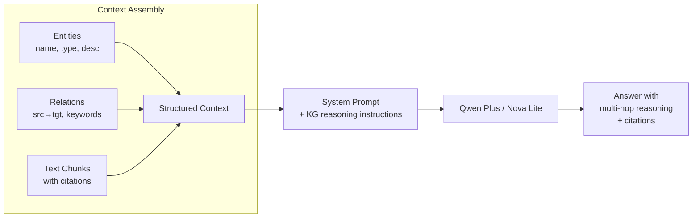

**File changes**:

| File                  | Change                                                                |
| --------------------- | --------------------------------------------------------------------- |
| `answer_generator.py` | Three-section context: entities_str + relations_str + text_chunks_str |
| `prompts.py`          | Add `kg_query_context` template, upgrade `rag_response`               |

**Context format** (injected into answer prompt):

```
=== ENTITIES ===
- ACME Corp [Organization]: Leading AI company founded in 2010...
- John Smith [Person]: CTO of ACME Corp since 2018...

=== RELATIONS ===
- John Smith → ACME Corp [works_at]: Appointed CTO in 2018...
- ACME Corp → Project X [develops]: Flagship AI product...

=== TEXT EVIDENCE ===
[1] Source Title | URL | Date
Relevant chunk text...

[2] Source Title | URL | Date
Relevant chunk text...
```

### 3.5 Community Detection (Optional Enhancement)

**What**: Periodic Louvain community detection on the Neo4j graph for thematic clustering.

**LightRAG reference**: `python-louvain` for community detection (not LLM-based).

**File changes**:

| File             | Change                                     |
| ---------------- | ------------------------------------------ |
| `community.py`   | **New** — periodic community detection job |
| `pyproject.toml` | Add `python-louvain` dependency (optional) |

**Implementation details**:

- Scheduled job (not real-time): export Neo4j subgraph → Louvain clustering → write community labels back
- Global retrieval can aggregate by community for better thematic grouping
- Low priority — implement after core Phase 3 features are validated

### Phase 3 — Final Workflow

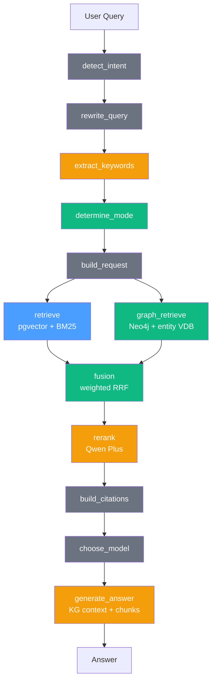

> Legend: ⚪ Existing, 🟡 Phase 1, 🟢 Phase 3, 🔵 Existing storage

---

## Cross-Phase Summary

### New Files (All Phases)

| Phase | New File                      | Purpose                                         |
| ----- | ----------------------------- | ----------------------------------------------- |
| 1     | `reranker.py`                 | LLM-based retrieval reranking                   |
| 1     | `test_reranker.py`            | Reranker tests                                  |
| 2     | `entity_extraction.py`        | Entity/relation extraction from chunks          |
| 2     | `prompts.py`                  | Centralized prompt templates                    |
| 2     | `graph_repository.py`         | Neo4j CRUD + traversal                          |
| 2     | `entity_vector_store.py`      | Entity/relation embeddings in pgvector          |
| 2     | `ingestion.py`                | Real-time ingestion orchestrator                |
| 2     | `test_entity_extraction.py`   | Extraction tests                                |
| 2     | `test_graph_repository.py`    | Neo4j tests                                     |
| 2     | `test_entity_vector_store.py` | Vector store tests                              |
| 2     | `test_ingestion.py`           | End-to-end ingestion tests                      |
| 2     | DB migration                  | `kb_entities` + `kb_relations` tables           |
| 3     | `graph_retriever.py`          | Graph-based retrieval engine                    |
| 3     | `hybrid_fusion.py`            | Weighted RRF fusion of graph + traditional hits |
| 3     | `community.py`                | Optional community detection                    |
| 3     | `test_graph_retriever.py`     | Graph retrieval tests                           |
| 3     | `test_hybrid_fusion.py`       | Hybrid fusion tests                             |

### Modified Files (All Phases)

| File                  | Phase 1                                      | Phase 2                                  | Phase 3                                  |
| --------------------- | -------------------------------------------- | ---------------------------------------- | ---------------------------------------- |
| `query_processing.py` | `extract_keywords()`, expand `rewrite_query` | —                                        | `determine_retrieval_mode()`             |
| `models.py`           | `KeywordResult`                              | `Entity`, `Relation`, `ExtractionResult` | `GraphContext`, `RetrievalMode`          |
| `workflow.py`         | `extract_keywords` + `rerank` nodes          | —                                        | `determine_mode` node, parallel retrieve |
| `config.py`           | keyword + rerank flags                       | Neo4j + extraction config                | graph retrieval config                   |
| `answer_generator.py` | prompt upgrade                               | —                                        | KG context injection                     |
| `repository.py`       | —                                            | —                                        | `get_chunks_by_ids()`                    |
| `lambda_tool.py`      | —                                            | —                                        | `_build_graph_retriever()` factory       |
| `pyproject.toml`      | —                                            | `neo4j` driver                           | `python-louvain` (optional)              |

### Feature Flags

| Flag                        | Phase | Default | Rollback Effect                         |
| --------------------------- | ----- | ------- | --------------------------------------- |
| `enable_keyword_extraction` | 1     | `True`  | Skip keyword node                       |
| `enable_reranking`          | 1     | `True`  | Pass hits directly to citations         |
| `enable_entity_extraction`  | 2     | `False` | Skip ingestion extraction               |
| `enable_graph_retrieval`    | 3     | `False` | Fall back to traditional retrieval only |

### New Dependencies

| Package          | Phase        | Purpose             |
| ---------------- | ------------ | ------------------- |
| `neo4j`          | 2            | Neo4j Python driver |
| `python-louvain` | 3 (optional) | Community detection |

### Risk & Rollback

| Phase | Risk        | Rollback                                                         |
| ----- | ----------- | ---------------------------------------------------------------- |
| 1     | Low         | Toggle feature flags off                                         |
| 2     | Medium      | Disable `enable_entity_extraction`, clear Neo4j data             |
| 3     | Medium-high | Disable `enable_graph_retrieval`, falls back to Phase 1 behavior |

### Storage Architecture (Post Phase 3)

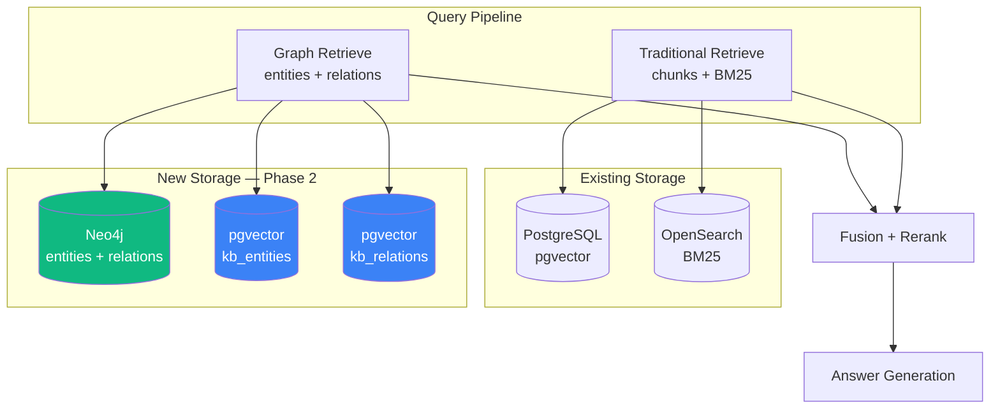
