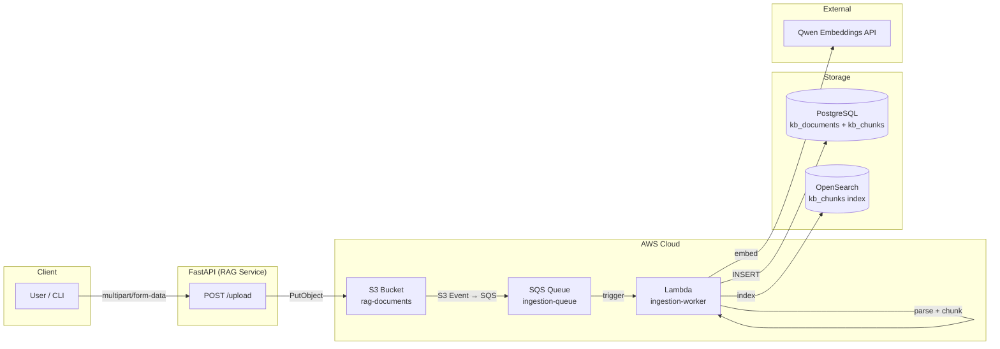
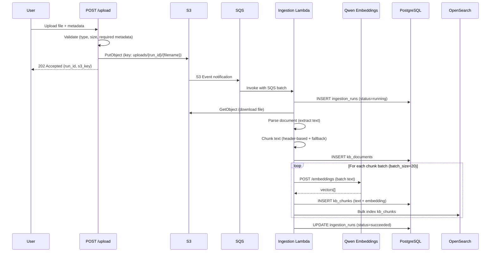
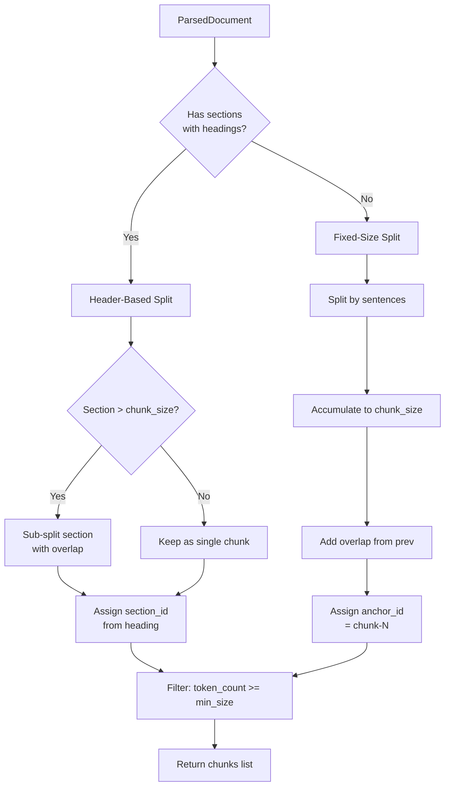
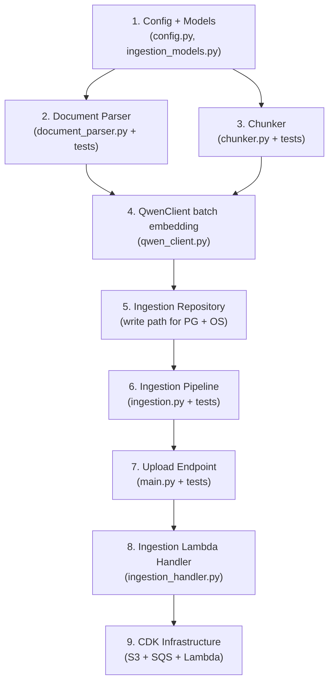

# Phase 1.5 — Document Ingestion Pipeline

> **Status**: Planning  
> **Prerequisite**: Phase 1 (keyword extraction, reranking, structured evidence) ✅  
> **Goal**: Build an end-to-end document ingestion pipeline that accepts files via upload, processes them async, and stores chunks + embeddings in PostgreSQL + OpenSearch for the existing hybrid retrieval to consume.

---

## Architecture Overview



## Data Flow (Sequence)



---

## Phase 1.5.1 — CDK Infrastructure

### New Resources

| Resource                | Type                          | Key Properties                                                                                                      |
| ----------------------- | ----------------------------- | ------------------------------------------------------------------------------------------------------------------- |
| `RagDocumentsBucket`    | `s3.Bucket`                   | `blockPublicAccess: ALL`, `autoDeleteObjects: true`, `removalPolicy: DESTROY`, lifecycle rule: expire after 90 days |
| `IngestionQueue`        | `sqs.Queue`                   | `visibilityTimeout: 300s` (5× Lambda timeout), `retentionPeriod: 14 days`, DLQ after 3 retries                      |
| `IngestionDLQ`          | `sqs.Queue`                   | Dead-letter queue for failed ingestion attempts                                                                     |
| `S3 → SQS notification` | `s3.EventType.OBJECT_CREATED` | `prefix: uploads/`, `suffix: (none)`                                                                                |
| `IngestionWorkerFn`     | `PythonFunction`              | Same Python entry as RAG service, handler: `ingestion_handler.handler`, timeout: 60s, memory: 1024MB                |

### CDK Code Location

Add to `packages/infra-cdk/lib/bedrock-agents-stack.ts` after the existing RAG Lambda block (~line 250).

### Lambda Environment Variables (new)

```
RAG_S3_BUCKET            # Bucket name (injected by CDK via bucket.bucketName)
RAG_INGESTION_QUEUE_URL  # SQS queue URL (for status polling, optional)
RAG_CHUNK_SIZE           # Target chunk size in tokens (default: 512)
RAG_CHUNK_OVERLAP        # Overlap in tokens (default: 64)
```

Plus all existing `RAG_DB_*`, `QWEN_*`, `RAG_OPENSEARCH_*` env vars (shared with RAG Lambda).

### IAM Permissions

- `IngestionWorkerFn` → `s3:GetObject` on bucket
- `IngestionWorkerFn` → `sqs:ReceiveMessage`, `sqs:DeleteMessage` on queue
- `IngestionWorkerFn` → `es:ESHttp*` on OpenSearch domain (reuse `ragSearchDomain.grantReadWrite`)
- `IngestionWorkerFn` → `secretsmanager:GetSecretValue` on DB password + Qwen key secrets (reuse existing grants)
- `RagSearchFn (upload endpoint)` → `s3:PutObject` on bucket

---

## Phase 1.5.2 — Document Parser Module

### New File: `apps/rag-service/app/document_parser.py`

Responsible for extracting raw text + metadata from uploaded files.

### Supported Formats

| Format     | MIME Type                                                                 | Library                   | Extraction Logic                                                                |
| ---------- | ------------------------------------------------------------------------- | ------------------------- | ------------------------------------------------------------------------------- |
| Plain Text | `text/plain`                                                              | stdlib                    | Direct `read()`                                                                 |
| Markdown   | `text/markdown`                                                           | stdlib                    | Raw text (preserve headers for chunking)                                        |
| PDF        | `application/pdf`                                                         | `pymupdf` (PyMuPDF)       | Page-by-page text extraction, preserve page numbers for `page_start`/`page_end` |
| DOCX       | `application/vnd.openxmlformats-officedocument.wordprocessingml.document` | `python-docx`             | Paragraph-by-paragraph extraction, heading-level detection                      |
| HTML       | `text/html`                                                               | `beautifulsoup4` + `lxml` | Strip tags, extract text from `<body>`, preserve heading structure              |

### Data Model

```python
@dataclass
class ParsedDocument:
    """Result of parsing a single uploaded document."""

    title: str                      # Extracted or filename-derived
    text: str                       # Full extracted text content
    mime_type: str                  # Detected MIME type
    sections: list[DocumentSection] # Structured sections (for header-based chunking)
    page_count: int | None          # Only for PDF
    metadata: dict[str, Any]        # Extracted metadata (author, date, etc.)


@dataclass
class DocumentSection:
    """A document section identified by header/heading."""

    heading: str                    # Section heading text
    level: int                      # Heading level (1-6)
    text: str                       # Section body text
    page_start: int | None          # Starting page (PDF only)
    page_end: int | None            # Ending page (PDF only)
    section_id: str                 # Generated: slugified heading
```

### Parser Interface

```python
def parse_document(file_bytes: bytes, filename: str, mime_type: str | None = None) -> ParsedDocument:
    """Parse a document file into structured text sections.

    Auto-detects MIME type from filename if not provided.
    Raises ValueError for unsupported formats.
    """
```

### New Dependencies

Add to `pyproject.toml` under `[project.dependencies]`:

```toml
"pymupdf>=1.25.0,<2",
"python-docx>=1.1.0,<2",
"beautifulsoup4>=4.13.0,<5",
"lxml>=5.3.0,<6",
```

---

## Phase 1.5.3 — Hybrid Chunking

### New File: `apps/rag-service/app/chunker.py`

Two-strategy chunking system:

### Strategy 1: Header-Based Splitting (preferred)

When `ParsedDocument.sections` has meaningful headers:

1. Split on section boundaries
2. If a section exceeds `chunk_size` tokens → sub-split with fixed-size fallback
3. Preserve `section_id` from heading for citation locator
4. Inherit `page_start`/`page_end` from section (PDF only)

### Strategy 2: Fixed-Size Fallback

When no headers are detected (plain text, poorly structured docs):

1. Split by sentence boundaries (using `re.split(r'(?<=[.!?])\s+', text)`)
2. Accumulate sentences until `chunk_size` tokens reached
3. Overlap: include last `chunk_overlap` tokens from previous chunk
4. Generate `anchor_id` as `chunk-{index}` for locator constraint

### Configuration

```python
# Via Settings (config.py)
RAG_CHUNK_SIZE: int = 512          # Target chunk size in tokens
RAG_CHUNK_OVERLAP: int = 64        # Overlap between consecutive chunks
RAG_CHUNK_MIN_SIZE: int = 50       # Minimum chunk size (discard smaller)
```

### Token Counting

Use a simple whitespace-based approximation: `len(text.split())` ≈ token count. This is consistent with how `token_count` is used in existing workflow (no external tokenizer dependency needed).

### Interface

```python
@dataclass
class Chunk:
    """A single text chunk ready for embedding and storage."""

    chunk_index: int
    chunk_text: str
    token_count: int
    page_start: int | None
    page_end: int | None
    section_id: str | None
    anchor_id: str | None


def chunk_document(
    parsed: ParsedDocument,
    chunk_size: int = 512,
    chunk_overlap: int = 64,
    min_chunk_size: int = 50,
) -> list[Chunk]:
    """Split parsed document into chunks for embedding.

    Uses header-based splitting when sections are available,
    falls back to fixed-size splitting otherwise.
    Guarantees at least one locator (page_start, section_id, or anchor_id)
    per chunk to satisfy the kb_chunks constraint.
    """
```

### Chunking Decision Flow



---

## Phase 1.5.4 — Embedding + Storage

### New File: `apps/rag-service/app/ingestion.py`

Orchestrates the full ingestion pipeline: parse → chunk → embed → store.

### Pipeline Steps

```python
async def ingest_document(
    s3_bucket: str,
    s3_key: str,
    upload_metadata: UploadMetadata,
    settings: Settings,
) -> IngestionResult:
    """Full ingestion pipeline for a single document.

    1. Download from S3
    2. Parse document
    3. Chunk text
    4. Generate embeddings (batched)
    5. Write to PostgreSQL (kb_documents + kb_chunks)
    6. Index in OpenSearch
    7. Update ingestion_runs status
    """
```

### Upload Metadata Model

```python
class UploadMetadata(BaseModel):
    """Metadata provided by the upload endpoint, stored in S3 object metadata."""

    title: str
    source_uri: str                # Original file URI or URL
    lang: str = "en"
    category: str = "general"
    published_year: int
    published_month: int
    author: str | None = None
    tags: list[str] = Field(default_factory=list)
    doc_version: str = "1.0"
```

### Embedding Strategy

- Use existing `QwenClient.embedding()` method
- Batch chunks (20 per batch) to reduce API calls
- Qwen text-embedding-v3 supports batch input — extend `QwenClient.embedding()` to accept `list[str]` and return `list[list[float]]`
- Dimension: 1024 (matches `VECTOR(1024)` column)

### PostgreSQL Write Pattern

```python
# Within a single transaction:
# 1. INSERT ingestion_runs (status=running)
# 2. INSERT or UPDATE kb_documents (upsert on source_uri + doc_version)
# 3. DELETE existing kb_chunks for this doc_id + doc_version (re-ingest)
# 4. BATCH INSERT kb_chunks with embeddings
# 5. UPDATE ingestion_runs (status=succeeded)
```

Use existing SQLAlchemy Core pattern from `repository.py` — define table objects for `ingestion_runs` and add write methods.

### OpenSearch Index Pattern

```python
# Bulk index using opensearch-py
# Document structure matches existing kb_chunks index:
{
    "_id": str(chunk_id),
    "_source": {
        "chunk_text": chunk_text,
        "doc_id": str(doc_id),
        "citation_url": citation_url,
        "citation_title": citation_title,
        "citation_year": citation_year,
        "citation_month": citation_month,
    }
}
```

### New Repository Methods

Add to `repository.py` or create separate `ingestion_repository.py`:

```python
class IngestionRepository:
    """Write-path repository for document ingestion."""

    def create_ingestion_run(self, config: dict) -> UUID: ...
    def complete_ingestion_run(self, run_id: UUID, status: str) -> None: ...
    def upsert_document(self, doc: DocumentRecord) -> UUID: ...
    def delete_chunks_for_doc(self, doc_id: UUID, doc_version: str) -> int: ...
    def batch_insert_chunks(self, chunks: list[ChunkRecord]) -> int: ...
    def bulk_index_opensearch(self, chunks: list[ChunkRecord]) -> None: ...
```

---

## Phase 1.5.5 — FastAPI Upload Endpoint

### New Endpoint: `POST /upload`

```python
@app.post("/upload", status_code=202)
async def upload_document(
    file: UploadFile,
    title: str = Form(...),
    source_uri: str = Form(""),
    lang: str = Form("en"),
    category: str = Form("general"),
    published_year: int = Form(...),
    published_month: int = Form(...),
    author: str | None = Form(None),
    tags: str = Form(""),           # Comma-separated
    doc_version: str = Form("1.0"),
) -> UploadResponse:
    """Accept a document upload, store in S3, return run_id.

    Processing happens asynchronously via S3 → SQS → Lambda.
    """
```

### Response Model

```python
class UploadResponse(BaseModel):
    run_id: str
    s3_key: str
    filename: str
    status: str = "accepted"
    message: str = "Document queued for ingestion"
```

### Validation Rules

1. **File size**: Max 50MB (`settings.max_upload_size_mb`)
2. **MIME type**: Must be in `SUPPORTED_MIME_TYPES`
3. **Required metadata**: `title`, `published_year`, `published_month`
4. **Content hash**: SHA-256 of file bytes (for dedup check in `kb_documents`)

### S3 Key Format

```
uploads/{run_id}/{sanitized_filename}
```

Object metadata includes the `UploadMetadata` fields as S3 user metadata (x-amz-meta-\*).

### New Config Settings

```python
# config.py additions
s3_bucket: str = Field(default="", validation_alias="RAG_S3_BUCKET")
max_upload_size_mb: int = Field(default=50, validation_alias="RAG_MAX_UPLOAD_SIZE_MB")
ingestion_chunk_size: int = Field(default=512, validation_alias="RAG_CHUNK_SIZE")
ingestion_chunk_overlap: int = Field(default=64, validation_alias="RAG_CHUNK_OVERLAP")
ingestion_chunk_min_size: int = Field(default=50, validation_alias="RAG_CHUNK_MIN_SIZE")
ingestion_embed_batch_size: int = Field(default=20, validation_alias="RAG_EMBED_BATCH_SIZE")
```

---

## Phase 1.5.6 — Ingestion Lambda Handler

### New File: `apps/rag-service/ingestion_handler.py`

Separate Lambda entry point for the SQS-triggered ingestion worker.

```python
def handler(event: dict, context: Any) -> dict:
    """SQS-triggered Lambda handler for document ingestion.

    Processes each SQS record:
    1. Parse S3 event from SQS message body
    2. Extract bucket + key
    3. Read upload metadata from S3 object metadata
    4. Run ingestion pipeline
    5. Return success/failure per record
    """
```

### Error Handling

- Parse/chunk failures → mark `ingestion_runs.status = 'failed'` with error in `notes`
- Embedding API timeout → retry up to 3 times with exponential backoff
- PostgreSQL write failure → rollback transaction, mark run failed
- SQS message stays in queue on Lambda error (retry via visibility timeout)
- After 3 failures → message goes to DLQ

---

## Phase 1.5.7 — Tests

### Test Files

| File                            | Tests                                                                                                                         |
| ------------------------------- | ----------------------------------------------------------------------------------------------------------------------------- |
| `tests/test_document_parser.py` | Parse TXT, MD, PDF (mock), DOCX (mock), HTML; unsupported format error; title extraction; section detection                   |
| `tests/test_chunker.py`         | Header-based split; fixed-size fallback; overlap behavior; min-size filter; locator guarantee; empty doc handling             |
| `tests/test_ingestion.py`       | Full pipeline (mocked S3 + DB + OpenSearch); batch embedding; upsert behavior; error handling; ingestion_runs status tracking |
| `tests/test_upload_endpoint.py` | Valid upload; size limit; unsupported format; missing metadata; S3 upload mock                                                |

### Test Fixtures

```python
# conftest.py additions
SAMPLE_TXT = "tests/fixtures/sample.txt"
SAMPLE_MD = "tests/fixtures/sample.md"
SAMPLE_HTML = "tests/fixtures/sample.html"
# PDF and DOCX: generate programmatically in fixtures to avoid binary files in repo
```

---

## File Summary

### New Files

| File                                             | Purpose                                                                                |
| ------------------------------------------------ | -------------------------------------------------------------------------------------- |
| `apps/rag-service/app/document_parser.py`        | Multi-format document parsing                                                          |
| `apps/rag-service/app/chunker.py`                | Header-based + fixed-size chunking                                                     |
| `apps/rag-service/app/ingestion.py`              | Orchestration pipeline (parse → chunk → embed → store)                                 |
| `apps/rag-service/app/ingestion_models.py`       | `UploadMetadata`, `UploadResponse`, `IngestionResult`, `DocumentRecord`, `ChunkRecord` |
| `apps/rag-service/ingestion_handler.py`          | SQS Lambda entry point                                                                 |
| `apps/rag-service/tests/test_document_parser.py` | Parser unit tests                                                                      |
| `apps/rag-service/tests/test_chunker.py`         | Chunker unit tests                                                                     |
| `apps/rag-service/tests/test_ingestion.py`       | Pipeline integration tests                                                             |
| `apps/rag-service/tests/test_upload_endpoint.py` | Upload endpoint tests                                                                  |
| `apps/rag-service/tests/fixtures/sample.txt`     | Test fixture                                                                           |
| `apps/rag-service/tests/fixtures/sample.md`      | Test fixture                                                                           |
| `apps/rag-service/tests/fixtures/sample.html`    | Test fixture                                                                           |

### Modified Files

| File                                             | Changes                                                                                           |
| ------------------------------------------------ | ------------------------------------------------------------------------------------------------- |
| `apps/rag-service/app/config.py`                 | Add `s3_bucket`, `max_upload_size_mb`, `ingestion_chunk_*`, `ingestion_embed_batch_size` settings |
| `apps/rag-service/app/main.py`                   | Add `POST /upload` endpoint                                                                       |
| `apps/rag-service/app/qwen_client.py`            | Extend `embedding()` for batch input support                                                      |
| `apps/rag-service/app/repository.py`             | Add `ingestion_runs` and `kb_documents` table objects; or create `ingestion_repository.py`        |
| `apps/rag-service/pyproject.toml`                | Add `pymupdf`, `python-docx`, `beautifulsoup4`, `lxml` dependencies                               |
| `apps/rag-service/requirements.txt`              | Mirror new dependencies                                                                           |
| `packages/infra-cdk/lib/bedrock-agents-stack.ts` | Add S3 bucket, SQS queue, DLQ, ingestion Lambda, event notification, IAM                          |
| `.env.example`                                   | Add `RAG_S3_BUCKET`, `RAG_CHUNK_SIZE`, `RAG_CHUNK_OVERLAP`, `RAG_EMBED_BATCH_SIZE`                |

---

## Implementation Order



## Open Questions

1. **Should the upload endpoint also support direct ingestion** (sync mode for small files, bypassing S3 → SQS → Lambda)? This would be useful for dev/testing but adds complexity.
2. **Should we add a `GET /ingestion/{run_id}` status endpoint** to check ingestion progress?
3. **Content dedup**: If same `content_hash` + `doc_version` already exists, skip or re-ingest?
4. **OpenSearch index mapping**: Does the existing `kb_chunks` index need explicit mapping creation, or is it auto-mapped?
