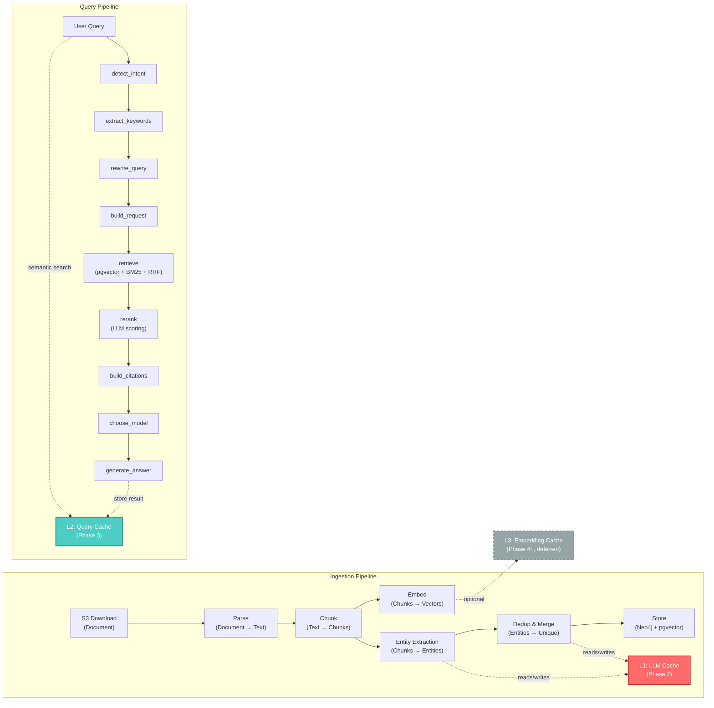

# RAG Caching Implementation Plan

> Implement a three-layer caching strategy for `apps/rag-service/` following LightRAG's "quality over quantity" principle.
> Only cache with clear ROI and operational maturity. Target: 70-80% cost reduction on re-ingestion workloads.

## 1. Overview and Philosophy

### Quality Over Quantity

Caching must provide measurable value and operational clarity. We implement exactly three cache layers in priority order, each with clear ROI and success metrics. Avoid cache bloat: not every operation needs a cache layer.

### Two Distinct Cache Opportunities

Our RAG pipeline has two LLM-heavy phases where caching delivers immediate value:

1. **Ingestion Time**: Entity/relation extraction and summary generation during knowledge graph construction (Phase 2). Same chunk content should never be LLM'd twice.
2. **Query Time**: Answer generation during retrieval-augmented synthesis (Phase 1 onward). Similar queries should return cached results without re-running the full pipeline.

This mirrors LightRAG's unique advantage: caching during graph construction phase, not just query-time caching.

### Design Principles

- **Deterministic Keys**: Cache keys must be deterministic. Changing a prompt template automatically invalidates old cache (via new key).
- **Source-Based Invalidation**: When a document is re-ingested with new content, invalidate all cache entries derived from it.
- **Feature Flags**: All layers default to disabled. Enable progressively per phase.
- **Observability**: Log cache hit/miss at INFO level. Track metrics for ROI validation.

## 2. Cache Architecture

### Pipeline Overview



### Layer Definition

| Layer                    | Target                                                       | Trigger            | Priority | Phase               |
| ------------------------ | ------------------------------------------------------------ | ------------------ | -------- | ------------------- |
| L1: LLM Extraction Cache | Entity/relation extraction + summary LLM calls               | Ingestion pipeline | Highest  | Phase 2             |
| L2: Query Result Cache   | Full RAG results (answer + citations) by semantic similarity | Query pipeline     | Medium   | Phase 3 ✅ DONE     |
| L3: Embedding Cache      | Embedding computation results                                | Ingestion dedup    | Low      | Phase 4+ (deferred) |

## 3. Cache Layers (Priority Order)

### Layer 1: LLM Extraction Cache (P1 - Phase 2)

**HIGHEST PRIORITY**

#### What

Cache entity and relation extraction LLM responses during ingestion. Every chunk processed through `EntityExtractor._llm_extraction()` and `EntityDeduplicator._merge_descriptions()` should check cache first.

#### Why

- Same chunk content should NEVER be LLM'd twice
- Re-ingestion of same document version = 100% cache hit
- Most expensive part of ingestion pipeline (LLM calls are 100-1000x costlier than embedding)
- Directly mirrors LightRAG's `enable_llm_cache` pattern

#### Cache Key Strategy

```
cache_key = sha256(
    f"{prompt_template_version}:{chunk_content}:{model_id}"
)
```

All three factors must match for a hit:

- **prompt_template_version**: Increment when changing extraction prompt. Automatically invalidates old cache.
- **chunk_content**: Full text of the chunk being extracted.
- **model_id**: Qwen model identifier (e.g., `qwen-plus`). Different models = different cache entries.

#### Cache Value

Raw LLM JSON response string (before parsing). Store the complete response from `QwenClient.chat()` to avoid re-parsing on hit.

#### Storage Backend

PostgreSQL table `llm_cache` (using existing RDS instance). Provides:

- Persistence across Lambda invocations
- Queryable metadata for analytics and debugging
- Automatic TTL-based cleanup via scheduled job
- Shared access across concurrent ingestion workers

#### Invalidation Strategy

**By Prompt Version**: When extraction prompt template changes (e.g., adding a new entity type), increment `prompt_template_version` in config. All new extractions use new cache keys automatically. Old entries orphaned, cleaned up by TTL.

**By Source Document**: Track `doc_id` in cache metadata. When document is re-ingested with new content hash, call `LLMCache.invalidate_by_source(doc_id)` to delete all related cache entries. Forces re-extraction with updated content.

**By TTL**: Background cleanup job deletes cache entries older than `RAG_CACHE_TTL_DAYS` (default: 30 days). Prevents unbounded cache growth.

#### Feature Flag

`RAG_ENABLE_LLM_CACHE=false` (default: off during Phase 2 development)

#### Configuration

```env
RAG_ENABLE_LLM_CACHE=false
RAG_CACHE_TTL_DAYS=30
RAG_LLM_CACHE_PROMPT_VERSION=1
```

#### Estimated Savings

**Cost Reduction**: 70-80% on re-ingestion of same documents or bulk document uploads with overlapping chunks.

Example: Ingesting 100 documents (1000 chunks) with 50% overlap:

- Without cache: 1000 LLM calls = $10 (assuming $0.01/call)
- With cache: 500 LLM calls + 500 cache hits = $5
- Savings: 50% per cycle, compounded across multiple ingestions

**Latency**: Negligible retrieval overhead (<5ms per cache lookup), far outweighed by LLM call savings (typically 10-30 seconds per call).

#### Implementation Checklist

- [ ] Create `app/llm_cache.py` with `LLMCache` class
- [ ] DB migration: create `llm_cache` table with indexes
- [ ] Wrap `EntityExtractor._llm_extraction()` with cache check
- [ ] Wrap `EntityDeduplicator._merge_descriptions()` with cache check
- [ ] Add config keys to `config.py`
- [ ] Add feature flag enforcement in ingestion pipeline
- [ ] Log cache hit/miss at INFO level
- [ ] Add background TTL cleanup job
- [ ] Unit tests for cache get/put/invalidate
- [ ] Integration tests with EntityExtractor

---

### Layer 2: Query Result Cache (P2 - Phase 3)

**MEDIUM PRIORITY**

#### What

Cache full RAG query results (answer + citations + metadata) by semantic similarity. Similar queries return cached results without re-running the entire 9-node pipeline.

#### Why

- Same user rarely asks identical questions, but semantically similar questions are common
- 5-10x latency improvement (avoid entire pipeline re-run)
- Query caching requires embeddings already computed in pipeline (no new dependency)
- Phase 3 work: coincides with graph-enhanced retrieval integration

#### Cache Key Strategy

```
query_embedding = embed_model.embed(query_text)
cache_key = "query:" + base64(query_embedding)
```

Lookup by **cosine similarity >= 0.95** (95% semantic match threshold). If multiple candidates exist at threshold, return most recent.

#### Cache Value

```json
{
  "answer": "...",
  "citations": [
    {
      "url": "...",
      "title": "...",
      "source": "...",
      "locator": "..."
    }
  ],
  "model_used": "qwen-plus",
  "timestamp": "2025-03-28T10:30:00Z",
  "query_original": "...",
  "query_rewritten": "...",
  "retrieval_latency_ms": 250,
  "generation_latency_ms": 1500
}
```

#### Storage Backend

PostgreSQL table `query_cache` with pgvector column for semantic matching:

```sql
CREATE TABLE query_cache (
    cache_key        TEXT PRIMARY KEY,
    query_embedding  vector(1024),     -- matches RAG_EMBED_DIM (Qwen text-embedding-v3)
    query_original   TEXT NOT NULL,
    query_rewritten  TEXT,
    answer           TEXT NOT NULL,
    citations        JSONB,
    model_used       TEXT,
    created_at       TIMESTAMPTZ DEFAULT now(),
    accessed_at      TIMESTAMPTZ DEFAULT now(),
    hit_count        INTEGER DEFAULT 0,
    source_doc_ids   TEXT[] DEFAULT '{}' -- for source-based invalidation
);

CREATE INDEX idx_query_cache_embedding ON query_cache
USING ivfflat (query_embedding vector_cosine_ops);
CREATE INDEX idx_query_cache_created_at ON query_cache(created_at);
CREATE INDEX idx_query_cache_source_docs ON query_cache USING GIN (source_doc_ids);
```

#### Invalidation Strategy

**By Similarity Threshold**: Cache lookup uses `similarity >= 0.95`. No match = cache miss, fall through to normal pipeline.

**By Source Document**: When document is re-ingested, invalidate queries that retrieved from that document. Query `WHERE source_doc_ids @> ARRAY[doc_id]::TEXT[]` and delete matching entries.

**By TTL**: Default 24 hours. Older entries cleaned up automatically (more aggressive than L1 because query results are context-sensitive).

#### Feature Flag

`RAG_ENABLE_QUERY_CACHE=false` (default: off during Phase 3 development)

#### Configuration

```env
RAG_ENABLE_QUERY_CACHE=false
RAG_QUERY_CACHE_TTL_HOURS=24
RAG_QUERY_CACHE_SIMILARITY_THRESHOLD=0.95
```

#### Estimated Savings

**Latency**: 5-10x improvement on repeated/similar queries. Average query latency ~2-3 seconds with caching vs. 20-30 seconds without.

**Cost**: 50-70% reduction on query costs (assuming 30% of queries are repeats or semantic duplicates).

#### Implementation Checklist

- [x] Create `app/query_cache.py` with `QueryCache` class
- [x] DB migration: create `query_cache` table with pgvector column and indexes (self-contained in `QueryCache.ensure_table()`)
- [x] Add lookup hook in workflow before `detect_intent` node (`check_cache` node with conditional edge)
- [x] Add storage hook after `generate_answer` node (`store_cache` node)
- [x] Implement semantic similarity search with cosine distance (`<=>` operator)
- [x] Wrap source doc IDs for invalidation tracking (`source_doc_ids` extracted from `reranked_hits`)
- [x] Add feature flag enforcement (`RAG_ENABLE_QUERY_CACHE`)
- [x] Log cache hit/miss at INFO level
- [x] Add TTL cleanup job (`cleanup_expired()` method)
- [x] Unit tests for similarity matching (`tests/test_query_cache.py` — 16 tests)
- [x] Integration tests with workflow (`tests/test_workflow.py` — 8 new cache tests)

---

### Layer 3: Embedding Cache (P3 - Phase 4+, Deferred)

**LOW PRIORITY - NOT IN SCOPE FOR INITIAL IMPLEMENTATION**

#### What

Cache embedding computation results during ingestion to avoid redundant API calls. Same text chunks across documents don't need re-embedding.

#### Why

Lower ROI than extraction cache:

- Embedding is 10-100x cheaper than LLM calls
- API calls are already batched in pipeline
- Cost savings modest compared to L1

#### Implementation Deferral

Mark as "P4+ Future Work". Include stub in docs but explicitly exclude from Phase 2-3 roadmap. Revisit after L1 and L2 are proven in production.

## 4. Implementation Plan - Layer 1 (LLM Extraction Cache)

### 4.1 Cache Infrastructure

#### New Module: `app/llm_cache.py`

```python
from __future__ import annotations

import hashlib
from datetime import datetime, timedelta
from sqlalchemy import Engine, text
from app.config import Settings

class LLMCache:
    """
    LLM response cache with PostgreSQL backend.

    Caches extraction and summary LLM responses keyed by:
    - prompt_template_version (from config)
    - chunk_content (exact text being extracted)
    - model_id (LLM model identifier)
    """

    def __init__(self, settings: Settings, engine: Engine):
        self.settings = settings
        self.engine = engine

    @staticmethod
    def compute_key(
        prompt_version: str,
        content: str,
        model_id: str
    ) -> str:
        """
        Compute deterministic cache key.

        Args:
            prompt_version: Version of extraction prompt (e.g., "1", "2")
            content: Full text of chunk being extracted
            model_id: LLM model ID (e.g., "qwen-plus")

        Returns:
            Hex SHA256 hash as cache key
        """
        key_str = f"{prompt_version}:{content}:{model_id}"
        return hashlib.sha256(key_str.encode()).hexdigest()

    def get(self, cache_key: str) -> str | None:
        """
        Retrieve cached LLM response by key.

        Args:
            cache_key: Output of compute_key()

        Returns:
            Cached JSON response string, or None if not found/expired
        """
        # Implementation: SQL SELECT with TTL check
        pass

    def put(
        self,
        cache_key: str,
        value: str,
        metadata: dict,
    ) -> None:
        """
        Store LLM response in cache.

        Args:
            cache_key: Output of compute_key()
            value: Raw LLM JSON response string
            metadata: Dict with keys: doc_id, chunk_id, prompt_version, model_id
        """
        # Implementation: SQL INSERT or UPDATE
        pass

    def invalidate_by_source(self, doc_id: str) -> int:
        """
        Invalidate all cache entries from a specific document.

        Called when document is re-ingested with new content.

        Args:
            doc_id: Document identifier

        Returns:
            Number of invalidated entries
        """
        # Implementation: SQL DELETE WHERE doc_id = ?
        pass

    def cleanup_expired(self, ttl_days: int) -> int:
        """
        Delete cache entries older than ttl_days.

        Can be called manually or by scheduled background job.

        Args:
            ttl_days: Age threshold in days

        Returns:
            Number of deleted entries
        """
        # Implementation: SQL DELETE WHERE created_at < now() - interval
        pass
```

#### Database Schema

```sql
CREATE TABLE IF NOT EXISTS llm_cache (
    cache_key       TEXT PRIMARY KEY,
    cache_value     TEXT NOT NULL,

    -- Metadata for invalidation and debugging
    prompt_version  TEXT NOT NULL,
    model_id        TEXT NOT NULL,
    doc_id          TEXT,
    chunk_id        TEXT,

    -- Lifecycle tracking
    created_at      TIMESTAMPTZ DEFAULT CURRENT_TIMESTAMP,
    accessed_at     TIMESTAMPTZ DEFAULT CURRENT_TIMESTAMP,
    hit_count       INTEGER DEFAULT 0,

    CONSTRAINT llm_cache_valid_cache_key CHECK (cache_key ~ '^[a-f0-9]{64}$')
);

-- Indexes for invalidation and cleanup
CREATE INDEX idx_llm_cache_doc_id
    ON llm_cache(doc_id)
    WHERE doc_id IS NOT NULL;

CREATE INDEX idx_llm_cache_created_at
    ON llm_cache(created_at DESC);

CREATE INDEX idx_llm_cache_model_prompt
    ON llm_cache(model_id, prompt_version);
```

### 4.2 Configuration Changes

#### Update `app/config.py`

Add to `Settings` class:

```python
class Settings(BaseSettings):
    # ... existing settings ...

    # --- LLM Caching (Layer 1) ---
    enable_llm_cache: bool = Field(
        default=False,
        validation_alias="RAG_ENABLE_LLM_CACHE",
    )
    cache_ttl_days: int = Field(
        default=30,
        ge=1,
        validation_alias="RAG_CACHE_TTL_DAYS",
    )
    llm_cache_prompt_version: str = Field(
        default="1",
        validation_alias="RAG_LLM_CACHE_PROMPT_VERSION",
        description="Increment when changing extraction prompt to auto-invalidate cache",
    )
```

#### Environment Variables

```env
# Layer 1: LLM Extraction Cache (Phase 2)
RAG_ENABLE_LLM_CACHE=false
RAG_CACHE_TTL_DAYS=30
RAG_LLM_CACHE_PROMPT_VERSION=1
```

### 4.3 Integration Points

#### Pattern: Cache Check Before LLM Call

```python
# In EntityExtractor or EntityDeduplicator

if settings.enable_llm_cache:
    cache_key = LLMCache.compute_key(
        prompt_version=settings.llm_cache_prompt_version,
        content=chunk_content,
        model_id="qwen-plus"
    )

    cached_response = llm_cache.get(cache_key)
    if cached_response:
        logger.info(f"LLM cache HIT: {cache_key[:8]}...")
        # Parse cached JSON and return
        return json.loads(cached_response)

    logger.info(f"LLM cache MISS: {cache_key[:8]}...")

# Call LLM
response = qwen_client.chat(...)
response_json = json.dumps(response)

# Store in cache
if settings.enable_llm_cache:
    llm_cache.put(
        cache_key=cache_key,
        value=response_json,
        metadata={
            "doc_id": doc_id,
            "chunk_id": chunk_id,
            "prompt_version": settings.llm_cache_prompt_version,
            "model_id": "qwen-plus"
        }
    )

return response
```

#### Sequence Diagram

```
EntityExtractor._llm_extraction()
    |
    +-- if RAG_ENABLE_LLM_CACHE:
    |       |
    |       +-- compute_key(prompt_version, chunk_content, model_id)
    |       |
    |       +-- LLMCache.get(key)
    |       |
    |       +-- if HIT:
    |       |       LOG "cache HIT"
    |       |       RETURN cached_response
    |       |
    |       +-- if MISS:
    |               LOG "cache MISS"
    |
    +-- QwenClient.chat(...)  [LLM call]
    |
    +-- if RAG_ENABLE_LLM_CACHE:
    |       |
    |       +-- LLMCache.put(key, response, metadata)
    |
    +-- RETURN response
```

### 4.4 Tests

#### Unit Tests: `tests/test_llm_cache.py`

```python
def test_compute_key_deterministic():
    """Same inputs produce same key."""
    key1 = LLMCache.compute_key("1", "text", "qwen-plus")
    key2 = LLMCache.compute_key("1", "text", "qwen-plus")
    assert key1 == key2

def test_compute_key_differs_on_version():
    """Different prompt versions produce different keys."""
    key1 = LLMCache.compute_key("1", "text", "qwen-plus")
    key2 = LLMCache.compute_key("2", "text", "qwen-plus")
    assert key1 != key2

def test_get_miss_on_nonexistent_key():
    """Getting nonexistent key returns None."""
    cache = LLMCache(settings, engine)
    result = cache.get("nonexistent_key")
    assert result is None

def test_put_and_get():
    """Put then get returns same value."""
    cache = LLMCache(settings, engine)
    key = "test_key_123"
    value = '{"entities": []}'
    cache.put(key, value, {"doc_id": "doc1"})
    result = cache.get(key)
    assert result == value

def test_invalidate_by_source():
    """Invalidate by doc_id removes related entries."""
    cache = LLMCache(settings, engine)
    # Put 3 entries: 2 for doc1, 1 for doc2
    cache.put("key1", '{}', {"doc_id": "doc1"})
    cache.put("key2", '{}', {"doc_id": "doc1"})
    cache.put("key3", '{}', {"doc_id": "doc2"})

    count = cache.invalidate_by_source("doc1")
    assert count == 2
    assert cache.get("key1") is None
    assert cache.get("key3") is not None

def test_cleanup_expired():
    """Cleanup removes entries older than TTL."""
    cache = LLMCache(settings, engine)
    # Put entry with old created_at (mock)
    # ... implementation test ...
    count = cache.cleanup_expired(ttl_days=30)
    assert count > 0
```

#### Integration Tests: `tests/test_entity_extractor_with_cache.py`

```python
def test_entity_extractor_uses_cache():
    """Entity extractor checks cache before calling LLM."""
    settings.enable_llm_cache = True
    extractor = EntityExtractor(settings, llm_cache)

    chunk_content = "Apple Inc. is headquartered in Cupertino."

    # First call: cache miss, calls LLM
    result1 = extractor.extract(chunk_content, doc_id="doc1")

    # Second call: cache hit, no LLM call
    result2 = extractor.extract(chunk_content, doc_id="doc1")

    assert result1 == result2
    # Verify LLM was called only once (via mock call count)

def test_cache_invalidation_on_document_reingest():
    """Re-ingesting document invalidates its cache entries."""
    settings.enable_llm_cache = True

    # Ingest doc once
    result1 = ingest_document("doc1", "version1.pdf")

    # Invalidate cache for doc1
    count = llm_cache.invalidate_by_source("doc1")
    assert count > 0

    # Re-ingest same doc (no cache hit this time)
    result2 = ingest_document("doc1", "version2.pdf")
```

### 4.5 Monitoring and Observability

#### Logging

At INFO level, log cache operations:

```python
logger.info(
    "LLM cache operation",
    extra={
        "operation": "hit",  # or "miss", "put", "invalidate"
        "cache_key": cache_key[:8] + "...",
        "doc_id": doc_id,
        "latency_ms": elapsed_ms
    }
)
```

#### Metrics

Track via CloudWatch or application metrics:

| Metric                    | Type      | Description                                  |
| ------------------------- | --------- | -------------------------------------------- |
| `llm_cache_hit_count`     | Counter   | Total cache hits                             |
| `llm_cache_miss_count`    | Counter   | Total cache misses                           |
| `llm_cache_hit_rate`      | Gauge     | Hit rate percentage (hits / (hits + misses)) |
| `llm_cache_size_bytes`    | Gauge     | Current cache table size in PostgreSQL       |
| `llm_cache_latency_ms`    | Histogram | Lookup latency distribution                  |
| `llm_cache_entries_count` | Gauge     | Total entries in cache                       |

#### Dashboards

Sample CloudWatch dashboard query:

```
fields @timestamp, operation, doc_id, latency_ms
| filter @message like /LLM cache operation/
| stats count() as total_ops, sum(latency_ms) as total_latency by operation
```

## 5. Implementation Plan - Layer 2 (Query Result Cache) ✅ IMPLEMENTED

### 5.1 High-Level Overview

Query result caching has been implemented in Phase 3. Key files:

- **`app/query_cache.py`**: `QueryCache` class with `ensure_table()`, `lookup()`, `store()`, `invalidate_by_doc()`, `cleanup_expired()`
- **`app/config.py`**: 3 new settings — `enable_query_cache`, `query_cache_ttl_hours`, `query_cache_similarity_threshold`
- **`app/workflow.py`**: Two new nodes (`check_cache`, `store_cache`) with conditional routing on cache hit/miss
- **`tests/test_query_cache.py`**: 16 unit tests covering all cache operations
- **`tests/test_workflow.py`**: 8 new workflow integration tests for cache behavior

### 5.2 Architecture

- `check_cache` node runs before `detect_intent` — builds query embedding, performs cosine similarity lookup
- On cache hit (similarity >= threshold): returns cached answer/citations, skips full pipeline
- On cache miss: falls through to normal `detect_intent → ... → generate_answer` pipeline
- `store_cache` node runs after `generate_answer` — stores result with source_doc_ids for invalidation
- All cache operations are gracefully degraded (errors caught, pipeline continues)

### 5.3 Implementation Checklist

- [x] Create `app/query_cache.py` with `QueryCache` class
- [x] DB migration: create `query_cache` table with pgvector (self-contained in `ensure_table()`)
- [x] Add similarity search implementation (cosine_distance >= 0.95)
- [x] Hook into workflow before `detect_intent` and after `generate_answer`
- [x] Implement source-document-based invalidation
- [x] Add feature flag `RAG_ENABLE_QUERY_CACHE`
- [x] Tests and integration validation (24 new tests total, 415 tests passing)

## 6. Invalidation Strategy

### Source-Document-Based Invalidation

When a document is re-ingested:

1. Compute new `content_hash` of document file
2. Compare against previous `content_hash` stored in ingestion metadata
3. If changed, call `LLMCache.invalidate_by_source(doc_id)` and `QueryCache.invalidate_by_source(doc_id)`
4. Re-extract and re-cache all entities from document
5. Queries that referenced old doc now show cache misses (cache invalidated automatically)

### Prompt-Version-Based Invalidation

When extraction prompt is modified:

1. Increment `RAG_LLM_CACHE_PROMPT_VERSION` in configuration
2. All new cache key computations use new version, automatically creating new cache keys
3. Old entries orphaned but still present in database
4. Background TTL cleanup job deletes old entries after retention window

### Manual Invalidation

Operational tools for manual cache management:

```python
# Invalidate all cache for a specific document
llm_cache.invalidate_by_source(doc_id="doc123")

# Invalidate all cache older than 7 days (manual cleanup)
llm_cache.cleanup_expired(ttl_days=7)

# Query for debugging
SELECT cache_key, created_at, hit_count, doc_id
FROM llm_cache
WHERE doc_id = 'doc123'
ORDER BY accessed_at DESC;
```

### TTL-Based Cleanup

Background job runs daily (or hourly for Query Cache):

```python
# In scheduled task or Lambda
llm_cache.cleanup_expired(
    ttl_days=settings.cache_ttl_days
)

query_cache.cleanup_expired(
    ttl_hours=settings.query_cache_ttl_hours
)
```

## 7. Feature Flags and Rollout

### Feature Flag Matrix

| Flag                         | Default | Phase | Layer | Effect when OFF                       |
| ---------------------------- | ------- | ----- | ----- | ------------------------------------- |
| `RAG_ENABLE_LLM_CACHE`       | `false` | 2     | L1    | All LLM calls executed, no caching    |
| `RAG_ENABLE_QUERY_CACHE`     | `false` | 3     | L2    | All queries re-run, no result caching |
| `RAG_ENABLE_EMBEDDING_CACHE` | N/A     | 4+    | L3    | Deferred, not yet implemented         |

### Rollout Timeline

#### Phase 2 (LLM Extraction Cache)

1. **Development**: Implement L1 with flag `RAG_ENABLE_LLM_CACHE=false` (off)
2. **Testing**: Enable in test environment, verify cache keys are deterministic and TTL cleanup works
3. **Staging**: Enable with monitoring, check hit rates and cost savings
4. **Production**: Enable gradually (canary to 10% → 50% → 100% of Lambda concurrency), monitor for anomalies
5. **Validation**: Confirm 70-80% cost reduction on re-ingestion workloads

#### Phase 3 (Query Result Cache)

1. **Development**: Implement L2 with flag `RAG_ENABLE_QUERY_CACHE=false` (off)
2. **Testing**: Verify semantic similarity matching and source-doc invalidation
3. **Staging**: Enable, monitor hit rates on similar queries
4. **Production**: Gradual rollout with active monitoring
5. **Validation**: Confirm 5-10x latency improvement on repeated queries

#### Phase 4+ (Embedding Cache)

Plan deferred; include in long-term roadmap only after L1 and L2 proven in production.

### Monitoring During Rollout

- **Cache Hit Rate**: Monitor hit_rate metric. Expected: 50-80% on L1, 20-40% on L2
- **Latency**: Compare query latency before/after. Expected: L1 invisible, L2 5-10x improvement
- **Cost**: Track LLM API costs. Expected: 70-80% reduction on L1 (when hit rate stabilizes)
- **Errors**: Log any cache-related exceptions. Should be zero misses due to implementation bugs

## 8. Success Criteria

### Layer 1 (LLM Extraction Cache) - Phase 2

- [ ] Cache hit rate > 80% on re-ingestion of same documents
- [ ] Cache hit rate > 50% on bulk multi-document ingestion with overlapping chunks
- [ ] Zero stale data incidents (cache invalidation working correctly)
- [ ] Cache lookup latency < 5ms per LLM call
- [ ] No behavioral change when cache is disabled (feature flag off)
- [ ] LLM API cost reduction of 70-80% on re-ingestion workloads
- [ ] Operational tools (`invalidate_by_source`, `cleanup_expired`) work as documented
- [ ] TTL cleanup job runs without errors (daily or as configured)

### Layer 2 (Query Result Cache) - Phase 3

- [ ] Cache hit rate > 20% on typical production queries
- [ ] Semantic similarity matching works at 0.95+ threshold
- [ ] Query latency improvement of 5-10x on cache hits
- [ ] Source-document invalidation does not leave stale results
- [ ] Query cache size remains bounded (TTL cleanup working)

### General

- [ ] All code paths with caching disabled produce identical results to enabled code paths
- [ ] Cache implementation does not introduce new external dependencies (uses existing RDS + pgvector)
- [ ] Monitoring dashboards provide visibility into cache health and ROI

## 9. Relationship to Existing Work

### Dependency Chain

```
Phase 1 (Query Enhancement) - COMPLETE
    ↓
Phase 2 (Knowledge Graph) - IN PROGRESS
    ├─ 2.1 Entity Extraction (EntityExtractor)
    ├─ 2.2 Dedup & Merge (EntityDeduplicator)
    ├─ 2.3 Neo4j Storage
    ├─ 2.4 Entity Vector Store
    ├─ 2.5 Ingestion Pipeline Wiring
    ↓
[THIS PLAN] Layer 1 Cache (LLM Extraction Cache)
    ↓ (wraps extraction calls)
    ├─ EntityExtractor._llm_extraction()
    └─ EntityDeduplicator._merge_descriptions()
    ↓
Phase 3 (Graph-Enhanced Retrieval)
    ↓
[DONE] Layer 2 Cache (Query Result Cache)
    ↓ (wraps workflow nodes)
    └─ workflow.py: check_cache → detect_intent → ... → generate_answer → store_cache
```

### References

- **Research**: `docs/rag-caching-research.md` contains background analysis of LightRAG's caching approach and reference implementations
- **Migration Context**: `docs/lightrag-migration-plan.md` provides overall Phase 1-3 roadmap
- **Ingestion Details**: `docs/phase1.5-document-ingestion-plan.md` describes ingestion pipeline that Layer 1 cache will optimize
- **Entity Extraction**: `docs/qwen-plus-entity-extraction-spec.md` specifies the LLM extraction being cached

### Implementation Dependencies

- PostgreSQL RDS instance (already deployed by CDK)
- pgvector extension (already installed on RDS)
- SQLAlchemy with psycopg (already in `pyproject.toml`)
- QwenClient (synchronous, already present in `app/qwen_client.py`)

## 10. Appendix: Migration Checklist

### Pre-Implementation

- [ ] Review `docs/rag-caching-research.md` for context
- [ ] Review LightRAG cache implementation in `use_llm_func_with_cache()` reference
- [ ] Plan PostgreSQL schema migration and deployment strategy

### Implementation (Phase 2)

- [ ] Create `app/llm_cache.py` module
- [ ] Add cache configuration to `app/config.py`
- [ ] Write PostgreSQL migration script
- [ ] Integrate cache into EntityExtractor
- [ ] Integrate cache into EntityDeduplicator
- [ ] Add logging and metrics
- [ ] Write unit and integration tests
- [ ] Document API and operational procedures

### Testing and Validation

- [ ] Unit tests pass (100% coverage on cache methods)
- [ ] Integration tests pass (EntityExtractor with cache)
- [ ] Manual testing: verify cache hit/miss behavior
- [ ] Load testing: verify no latency regression
- [ ] Staging deployment: test with production-like data volumes

### Monitoring and Operations

- [ ] CloudWatch dashboard configured
- [ ] Alerts configured for cache anomalies (hit rate drop, size growth)
- [ ] Runbook written for manual cache operations
- [ ] On-call team trained on cache troubleshooting

### Documentation

- [ ] API documentation updated
- [ ] Operational procedures documented
- [ ] Monitoring dashboard documented
- [ ] Rollout plan communicated to team
