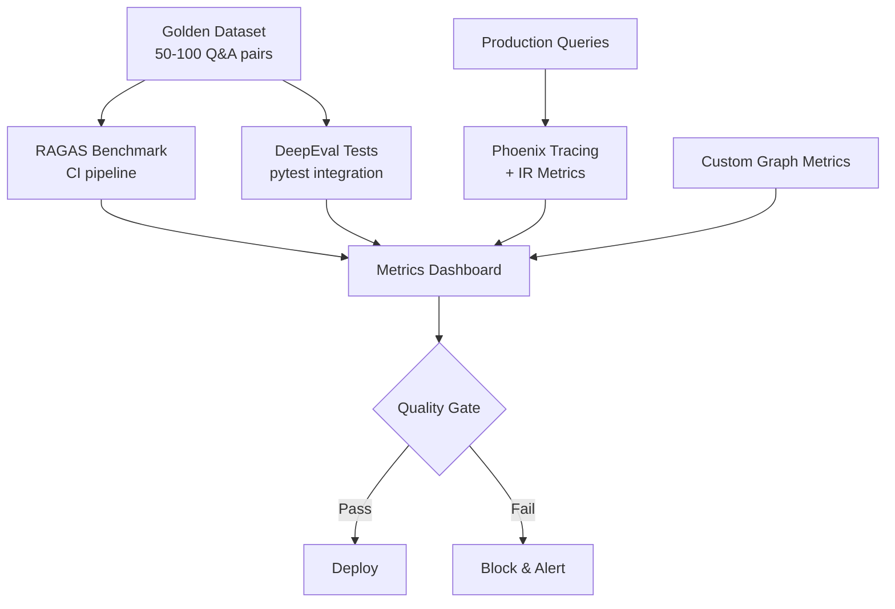
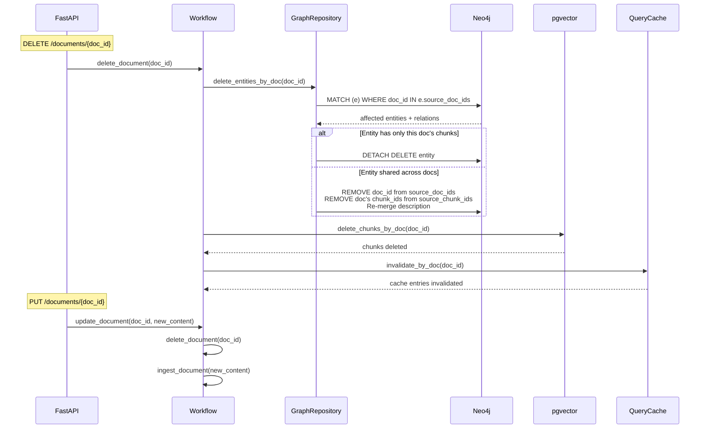
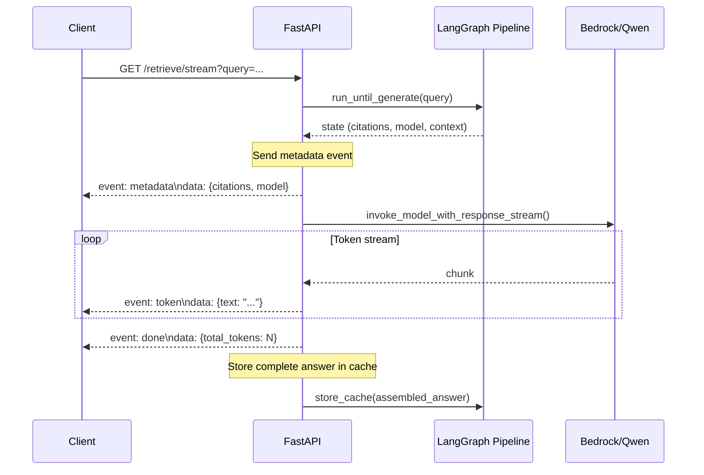
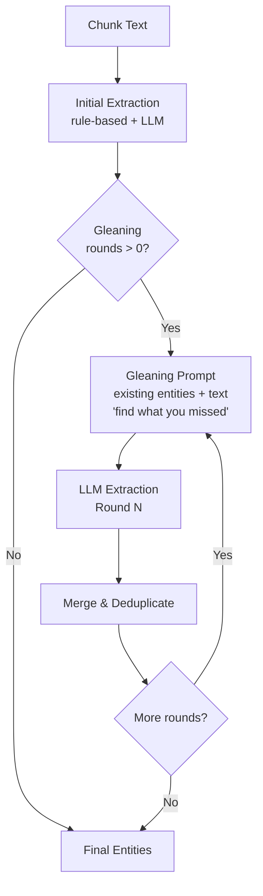
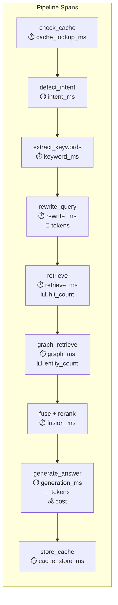
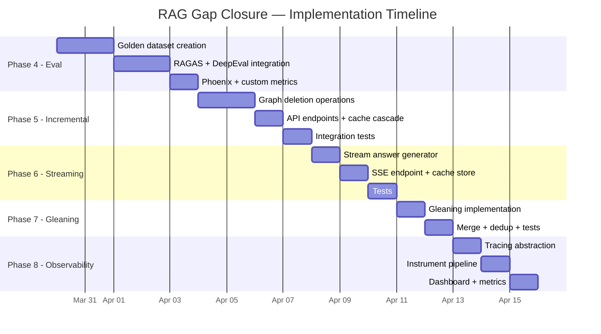

# RAG Gap Analysis & Implementation Plan

> **Date**: 2026-03-28
> **Status**: Living document — update as phases are completed
> **Companion doc**: [LightRAG Migration Plan](./lightrag-migration-plan.md) (Phases 1–3 ✅ DONE)

---

## Table of Contents

1. [Executive Summary](#executive-summary)
2. [Feature Comparison Matrix](#feature-comparison-matrix)
3. [Architecture Comparison](#architecture-comparison)
4. [Phase 4 — Evaluation Framework](#phase-4--evaluation-framework-p1) (P1)
5. [Phase 5 — Incremental Graph Update](#phase-5--incremental-graph-update--document-deletion-p0) (P0)
6. [Phase 6 — Streaming Query (SSE)](#phase-6--streaming-query-sse-p1) (P1)
7. [Phase 7 — Gleaning (Multi-Round Extraction)](#phase-7--gleaning-multi-round-entity-extraction-p1) (P1)
8. [Phase 8 — Observability](#phase-8--observability-tracing--metrics-p2) (P2)
9. [Deferred Items](#deferred-items)
10. [Cross-Phase Summary](#cross-phase-summary)
11. [Metrics & Targets](#metrics--targets)

---

## Executive Summary

Our RAG service is a production-grade, 14-node LangGraph pipeline with Neo4j + pgvector dual storage, weighted RRF fusion, Qwen LLM reranking, intent-aware answer generation, and L2 semantic query caching. Compared to open-source [LightRAG](https://github.com/HKUDS/LightRAG) (15k+ ⭐), we lead in retrieval quality (reranking, fusion, sparse BM25, citations) but trail in operational features (incremental updates, streaming, observability, evaluation).

**Completed** (Phases 1–3 + L2 Cache):

- ✅ Phase 1: Reranker (Qwen LLM)
- ✅ Phase 2: Knowledge Graph Ingestion (Neo4j + entity extraction)
- ✅ Phase 3: Graph-Enhanced Retrieval (3.1–3.4)
- ✅ L2 Query Result Cache (semantic similarity)

**This document** covers Phases 4–8: closing the remaining gaps against LightRAG.

---

## Feature Comparison Matrix

| Capability                   | Our RAG                                                  | LightRAG                                            | Status      |
| ---------------------------- | -------------------------------------------------------- | --------------------------------------------------- | ----------- |
| **Retrieval Modes**          | 7 (naive/local/global/hybrid/mix/graph_only/chunks_only) | 6 (naive/local/global/hybrid/mix/bypass)            | ✅ Ahead    |
| **Entity Extraction**        | Two-stage: rule-based + LLM, 7 domain-specific types     | Pure LLM with gleaning (multi-round), generic types | ≈ Even      |
| **Knowledge Graph**          | Neo4j + pgvector dual-write, 7 relation types            | Pluggable backends (Neo4j/networkx/etc)             | ≈ Even      |
| **Fusion Strategy**          | Weighted RRF (graph 0.6 + trad 0.4)                      | Round-robin merge                                   | ✅ Ahead    |
| **Reranking**                | Qwen LLM reranking with token budget                     | Cohere/Jina/BGE support                             | ✅ Ahead    |
| **Sparse Retrieval**         | OpenSearch BM25                                          | None                                                | ✅ Ahead    |
| **Answer Generation**        | Intent-aware prompts (4 types) + dynamic model routing   | Simple prompt templates                             | ✅ Ahead    |
| **Citations**                | Granular source mapping with scores                      | Basic source references                             | ✅ Ahead    |
| **Query Caching**            | L2 semantic cache (pgvector cosine ≥ 0.95)               | None                                                | ✅ Ahead    |
| **Incremental Graph Update** | ✅ Cascade delete + re-ingest                            | ✅ `adelete_by_doc_id()` + auto KG regen            | ✅ Done     |
| **Streaming**                | ❌ Batch response only                                   | ✅ SSE `/query/stream`                              | ⬜ Phase 6  |
| **Gleaning**                 | ❌ Single-pass extraction                                | ✅ Multi-round extraction + merge                   | ⬜ Phase 7  |
| **Observability**            | ❌ Basic logging                                         | ✅ Langfuse integration                             | ⬜ Phase 8  |
| **Evaluation**               | ❌ Manual testing only                                   | ✅ RAGAS integration                                | ⬜ Phase 4  |
| **Multi-tenancy**            | ❌ Single workspace                                      | ✅ Workspace isolation + JWT/API Key                | ⏭️ Deferred |
| **Concurrency**              | ❌ Basic                                                 | ✅ Semaphore-based rate limiting                    | ⏭️ Deferred |
| **Community Detection**      | ❌ Deferred (Phase 3.5)                                  | ✅ Louvain for global retrieval                     | ⏭️ Deferred |
| **Storage Backends**         | Fixed (Neo4j + pgvector + OpenSearch)                    | 14+ pluggable backends                              | N/A         |
| **Ingestion Formats**        | TXT/MD/PDF/DOCX/HTML                                     | TXT/PDF/DOCX/PPTX (+ vision LLM)                    | ≈ Even      |

---

## Architecture Comparison

```
┌─── Our RAG ────────────────────────┐    ┌─── LightRAG ─────────────────────┐
│                                     │    │                                   │
│  FastAPI + Lambda dual entry        │    │  FastAPI + CLI                    │
│  ↓                                  │    │  ↓                               │
│  14-node LangGraph pipeline         │    │  insert() / query() methods      │
│  ↓                                  │    │  ↓                               │
│  Intent → Keywords → Mode → Query   │    │  Keywords → Mode → Query         │
│  ↓                                  │    │  ↓                               │
│  Neo4j (graph) + pgvector (dense)   │    │  Pluggable graph + vector        │
│  + OpenSearch (sparse BM25)         │    │  (no sparse retrieval)           │
│  ↓                                  │    │  ↓                               │
│  Weighted RRF fusion                │    │  Round-robin merge               │
│  ↓                                  │    │  ↓                               │
│  Qwen LLM reranking                │    │  Optional external reranker      │
│  ↓                                  │    │  ↓                               │
│  Intent-aware generation            │    │  Template generation             │
│  + dynamic model routing            │    │  (single model)                  │
│  ↓                                  │    │  ↓                               │
│  L2 semantic cache                  │    │  No caching                      │
│                                     │    │                                   │
│  ✅ Cascade delete + re-ingest        │    │  ✅ Incremental + deletion       │
│  ❌ No streaming                    │    │  ✅ SSE streaming                │
│  ❌ No eval framework               │    │  ✅ RAGAS integration            │
│  ❌ No observability                │    │  ✅ Langfuse tracing             │
└─────────────────────────────────────┘    └───────────────────────────────────┘
```

---

## Phase 4 — Evaluation Framework (P1)

> **Priority**: P1 — Blocks ability to measure quality of all subsequent changes
> **Effort**: 4–5 days
> **Dependencies**: Golden test dataset creation

### 4.0 Why

Cannot objectively measure retrieval quality, detect regressions, or compare configurations without automated evaluation. Currently relying on manual testing. Every subsequent phase needs eval to prove it actually improves quality.

### 4.1 Framework Selection

We use 3 complementary frameworks — each covers a different evaluation dimension:

| Framework            | Role                   | Key Metrics                                                                  | Integration                           |
| -------------------- | ---------------------- | ---------------------------------------------------------------------------- | ------------------------------------- |
| **RAGAS** (13.1k ⭐) | CI benchmark standard  | Faithfulness, Answer Relevancy, Context Precision/Recall, Answer Correctness | `pip install ragas`, LangChain native |
| **DeepEval**         | Day-to-day dev testing | G-Eval (custom LLM-as-judge), faithfulness, relevancy, hallucination         | `pip install deepeval`, pytest plugin |
| **Phoenix/Arize**    | Production monitoring  | NDCG@k, Precision@k, Recall@k, MRR, Hit Rate, embedding drift                | `pip install arize-phoenix`           |

**Custom graph-aware metrics** (no framework provides these):

- **Graph Traversal Depth**: How many Neo4j hops contributed to the answer?
- **Multi-Source Recall**: Did the answer draw from entities across multiple documents?
- **Fusion Contribution Ratio**: What % of final answer came from graph vs vector retrieval?
- **Cache Hit Quality**: Are cached answers as good as freshly generated ones?

### 4.2 Data Flow



### 4.3 Golden Dataset Structure

```python
# tests/eval/golden_dataset.json
{
  "version": "1.0",
  "created": "2026-03-29",
  "entries": [
    {
      "id": "eval_001",
      "query": "What is the ISRC code for track X?",
      "expected_answer": "The ISRC code is ...",
      "expected_contexts": ["chunk_id_1", "chunk_id_2"],
      "expected_entities": ["track_x", "artist_y"],
      "intent": "factual",
      "complexity": "simple",
      "tags": ["metadata", "isrc"]
    }
  ]
}
```

### 4.4 File Changes

| File                                  | Action     | Description                                                                           |
| ------------------------------------- | ---------- | ------------------------------------------------------------------------------------- |
| `tests/eval/__init__.py`              | **CREATE** | Eval module init                                                                      |
| `tests/eval/golden_dataset.json`      | **CREATE** | 50-100 curated Q&A pairs with expected contexts and entities                          |
| `tests/eval/conftest.py`              | **CREATE** | Shared fixtures: load golden dataset, create eval workflow                            |
| `tests/eval/test_ragas_benchmark.py`  | **CREATE** | RAGAS metrics: faithfulness, answer relevancy, context precision/recall               |
| `tests/eval/test_deepeval_quality.py` | **CREATE** | DeepEval tests: G-Eval custom metrics, hallucination detection                        |
| `tests/eval/test_graph_metrics.py`    | **CREATE** | Custom graph-aware metrics: traversal depth, multi-source recall, fusion ratio        |
| `app/eval_metrics.py`                 | **CREATE** | Custom metric calculators (graph traversal depth, fusion contribution, cache quality) |
| `pyproject.toml`                      | **MODIFY** | Add `ragas`, `deepeval`, `arize-phoenix` to dev dependencies                          |
| `app/config.py`                       | **MODIFY** | Add `enable_eval_tracing: bool` (default False), `phoenix_endpoint: str`              |

### 4.5 RAGAS Integration Detail

```python
# tests/eval/test_ragas_benchmark.py
from ragas import evaluate
from ragas.metrics import faithfulness, answer_relevancy, context_precision, context_recall

def test_ragas_benchmark(golden_dataset, rag_workflow):
    """Run RAGAS evaluation against golden dataset. Blocks CI on regression."""
    results = []
    for entry in golden_dataset:
        state = rag_workflow.run(query=entry["query"], top_k=10)
        results.append({
            "question": entry["query"],
            "answer": state["answer"],
            "contexts": [h["content"] for h in state.get("reranked_hits", [])],
            "ground_truth": entry["expected_answer"],
        })

    dataset = Dataset.from_list(results)
    scores = evaluate(dataset, metrics=[faithfulness, answer_relevancy, context_precision, context_recall])

    assert scores["faithfulness"] >= 0.85, f"Faithfulness {scores['faithfulness']:.3f} < 0.85"
    assert scores["answer_relevancy"] >= 0.80, f"Answer Relevancy {scores['answer_relevancy']:.3f} < 0.80"
    assert scores["context_precision"] >= 0.75, f"Context Precision {scores['context_precision']:.3f} < 0.75"
    assert scores["context_recall"] >= 0.80, f"Context Recall {scores['context_recall']:.3f} < 0.80"
```

### 4.6 DeepEval Integration Detail

```python
# tests/eval/test_deepeval_quality.py
from deepeval import assert_test
from deepeval.metrics import FaithfulnessMetric, AnswerRelevancyMetric, HallucinationMetric
from deepeval.test_case import LLMTestCase

def test_no_hallucination(golden_entry, rag_workflow):
    """Each golden query must not hallucinate."""
    state = rag_workflow.run(query=golden_entry["query"], top_k=10)
    test_case = LLMTestCase(
        input=golden_entry["query"],
        actual_output=state["answer"],
        expected_output=golden_entry["expected_answer"],
        retrieval_context=[h["content"] for h in state.get("reranked_hits", [])],
    )
    metric = HallucinationMetric(threshold=0.5)
    assert_test(test_case, [metric])
```

### 4.7 Custom Graph Metrics

```python
# app/eval_metrics.py

def graph_traversal_depth(state: dict) -> int:
    """Count max Neo4j hops that contributed to final answer."""
    graph_ctx = state.get("graph_context")
    if not graph_ctx:
        return 0
    return max(len(path) for path in graph_ctx.get("paths", [[]])) if graph_ctx.get("paths") else 1

def fusion_contribution_ratio(state: dict) -> dict[str, float]:
    """What fraction of reranked_hits came from graph vs vector?"""
    hits = state.get("reranked_hits", [])
    if not hits:
        return {"graph": 0.0, "vector": 0.0}
    graph_count = sum(1 for h in hits if h.get("source") == "graph")
    return {
        "graph": graph_count / len(hits),
        "vector": (len(hits) - graph_count) / len(hits),
    }

def multi_source_recall(state: dict) -> int:
    """Count distinct source documents referenced in reranked hits."""
    hits = state.get("reranked_hits", [])
    return len({h.get("document_id") for h in hits if h.get("document_id")})
```

### 4.8 Acceptance Criteria

- [ ] Golden dataset with ≥50 Q&A pairs covering all 4 intents (factual/analytical/comparative/exploratory)
- [ ] RAGAS benchmark runs in CI, fails on regression below thresholds
- [ ] DeepEval hallucination test passes for all golden queries
- [ ] Custom graph metrics calculate correctly (unit tested)
- [ ] Phoenix tracing captures per-query spans in staging
- [ ] All eval tests pass: `pytest tests/eval/ -v`
- [ ] Baseline metrics recorded and committed

### 4.9 Test Plan

| Test                             | Type        | What it verifies                        |
| -------------------------------- | ----------- | --------------------------------------- |
| `test_ragas_benchmark`           | Integration | RAGAS scores above thresholds           |
| `test_no_hallucination`          | Integration | Zero hallucination on golden queries    |
| `test_graph_traversal_depth`     | Unit        | Correct hop counting from graph context |
| `test_fusion_contribution_ratio` | Unit        | Correct graph/vector ratio calculation  |
| `test_multi_source_recall`       | Unit        | Correct distinct doc counting           |
| `test_cache_hit_quality`         | Integration | Cached answers score ≥ 95% of fresh     |

---

## Phase 5 — Incremental Graph Update + Document Deletion (P0)

> **Priority**: P0 — Graph data rots without this
> **Effort**: 3–4 days
> **Dependencies**: Existing Neo4j source tracking (`source_chunk_ids` on entity nodes)

### 5.0 Why

When a document is re-ingested or deleted, its old entities and relations remain in Neo4j as stale data. Over time this poisons retrieval quality — the graph returns outdated or contradictory information. This is the single most critical operational gap.

### 5.1 LightRAG Reference

LightRAG's `adelete_by_doc_id()`:

1. Find all chunks belonging to `doc_id`
2. Find all entities/relations that reference those chunks
3. Delete entities that are **only** referenced by this document
4. For shared entities (referenced by multiple docs), remove the doc's chunk references
5. Re-merge entity descriptions from remaining sources
6. Delete chunks

### 5.2 Data Flow



### 5.3 File Changes

| File                               | Action       | Description                                                                                                    |
| ---------------------------------- | ------------ | -------------------------------------------------------------------------------------------------------------- |
| `app/graph_repository.py`          | **MODIFY**   | Add `delete_entities_by_doc(doc_id)`, `remove_doc_from_shared_entities(doc_id)`, `get_entities_by_doc(doc_id)` |
| `app/repository.py`                | **MODIFY**   | Add `delete_chunks_by_doc(doc_id)`, `delete_document(doc_id)`                                                  |
| `app/workflow.py`                  | **MODIFY**   | Add `delete_document(doc_id)` and `update_document(doc_id, content)` methods                                   |
| `app/main.py`                      | **MODIFY**   | Add `DELETE /documents/{doc_id}` and `PUT /documents/{doc_id}` endpoints                                       |
| `app/query_cache.py`               | **EXISTING** | Already has `invalidate_by_doc(doc_id)` — wire it into delete flow                                             |
| `app/models.py`                    | **MODIFY**   | Add `DeleteDocumentResponse`, `UpdateDocumentResponse` models                                                  |
| `tests/test_graph_repository.py`   | **MODIFY**   | Tests for entity deletion (exclusive + shared), cascading cleanup                                              |
| `tests/test_incremental_update.py` | **CREATE**   | Integration tests: delete → verify graph clean, update → verify re-ingested                                    |

### 5.4 Neo4j Operations

```cypher
-- Find entities exclusively owned by this document
MATCH (e:Entity)
WHERE e.source_doc_ids = [$doc_id]
RETURN e.entity_id, e.canonical_key

-- Find entities shared with other documents
MATCH (e:Entity)
WHERE $doc_id IN e.source_doc_ids AND size(e.source_doc_ids) > 1
RETURN e.entity_id, e.canonical_key, e.source_doc_ids, e.source_chunk_ids

-- Delete exclusively-owned entities and their relations
MATCH (e:Entity)
WHERE e.source_doc_ids = [$doc_id]
DETACH DELETE e

-- Clean up shared entities: remove doc references
MATCH (e:Entity)
WHERE $doc_id IN e.source_doc_ids AND size(e.source_doc_ids) > 1
SET e.source_doc_ids = [x IN e.source_doc_ids WHERE x <> $doc_id],
    e.source_chunk_ids = [x IN e.source_chunk_ids WHERE NOT x STARTS WITH $doc_id]

-- Delete orphaned relations (both endpoints deleted)
MATCH (e1:Entity)-[r:RELATES_TO]->(e2:Entity)
WHERE NOT exists((e1)--()) OR NOT exists((e2)--())
DELETE r
```

### 5.5 API Design

```python
# DELETE /documents/{doc_id}
@app.delete("/documents/{doc_id}")
async def delete_document(doc_id: str) -> DeleteDocumentResponse:
    """Delete document and cascade cleanup to graph, chunks, and cache."""
    result = await workflow.delete_document(doc_id)
    return DeleteDocumentResponse(
        doc_id=doc_id,
        entities_deleted=result["entities_deleted"],
        entities_updated=result["entities_updated"],
        chunks_deleted=result["chunks_deleted"],
        cache_entries_invalidated=result["cache_invalidated"],
    )

# PUT /documents/{doc_id}
@app.put("/documents/{doc_id}")
async def update_document(doc_id: str, content: str) -> UpdateDocumentResponse:
    """Delete old data, re-ingest new content."""
    delete_result = await workflow.delete_document(doc_id)
    ingest_result = await workflow.ingest_document(doc_id, content)
    return UpdateDocumentResponse(
        doc_id=doc_id,
        old_entities_removed=delete_result["entities_deleted"],
        new_entities_created=ingest_result["entities_created"],
        new_chunks_created=ingest_result["chunks_created"],
    )
```

### 5.6 Configuration

```python
# app/config.py — no new config needed
# Uses existing entity extraction and graph settings
# source_doc_ids already tracked on Entity nodes (graph_repository.py MERGE)
```

### 5.7 Acceptance Criteria

- [x] `DELETE /documents/{doc_id}` removes all exclusively-owned entities and relations
- [x] Shared entities retain data from other documents (source_chunk_ids pruned, not deleted)
- [x] pgvector chunks deleted for the document
- [x] L2 query cache invalidated for queries that cited deleted document
- [ ] `PUT /documents/{doc_id}` = atomic delete + re-ingest _(deferred — delete-then-re-upload via existing POST /upload)_
- [x] No orphaned relations left in Neo4j after deletion
- [x] Entity vector store entries cleaned up for deleted entities
- [x] All tests pass: `pytest tests/ -v` (438 tests including new delete tests)

### 5.8 Test Plan

| Test                                    | Type        | What it verifies                               |
| --------------------------------------- | ----------- | ---------------------------------------------- |
| `test_delete_exclusive_entities`        | Unit        | Entities owned only by deleted doc are removed |
| `test_delete_shared_entities_pruned`    | Unit        | Shared entities keep other docs' data          |
| `test_delete_cascades_to_chunks`        | Unit        | pgvector chunks removed                        |
| `test_delete_cascades_to_cache`         | Unit        | L2 cache entries invalidated                   |
| `test_delete_removes_orphan_relations`  | Unit        | No dangling relations                          |
| `test_update_is_atomic`                 | Integration | Delete + re-ingest produces clean state        |
| `test_update_preserves_shared_entities` | Integration | Other documents' entities unaffected           |
| `test_concurrent_delete_safety`         | Integration | Two deletes don't corrupt graph                |

---

## Phase 6 — Streaming Query (SSE) (P1)

> **Priority**: P1 — Critical for UX (5-15s blank screen currently)
> **Effort**: 2–3 days
> **Dependencies**: Bedrock `invoke_model_with_response_stream` API

### 6.0 Why

Users see a blank screen for 5-15 seconds during answer generation. Streaming the response via Server-Sent Events (SSE) gives instant perceived responsiveness — first token in <1 second.

### 6.1 Data Flow



### 6.2 File Changes

| File                             | Action     | Description                                                                                           |
| -------------------------------- | ---------- | ----------------------------------------------------------------------------------------------------- |
| `app/main.py`                    | **MODIFY** | Add `GET /retrieve/stream` SSE endpoint                                                               |
| `app/answer_generator.py`        | **MODIFY** | Add `generate_stream()` yielding token chunks from Bedrock                                            |
| `app/workflow.py`                | **MODIFY** | Add `run_until_generate()` — runs pipeline up to (but not including) `generate_answer`, returns state |
| `app/models.py`                  | **MODIFY** | Add `StreamEvent`, `StreamMetadata`, `StreamToken`, `StreamDone` models                               |
| `app/config.py`                  | **MODIFY** | Add `enable_streaming: bool = Field(default=True, validation_alias="RAG_ENABLE_STREAMING")`           |
| `tests/test_streaming.py`        | **CREATE** | SSE endpoint tests: token stream, error handling, cache storage                                       |
| `tests/test_answer_generator.py` | **MODIFY** | Tests for `generate_stream()`                                                                         |

### 6.3 SSE Event Format

```
event: metadata
data: {"citations": [...], "model": "qwen-plus", "intent": "factual"}

event: token
data: {"text": "The"}

event: token
data: {"text": " answer"}

event: token
data: {"text": " is..."}

event: done
data: {"total_tokens": 142, "latency_ms": 3200, "cache_stored": true}
```

### 6.4 Streaming Answer Generator

```python
# app/answer_generator.py — new method

async def generate_stream(
    self,
    model_route: ModelRoute,
    system_prompt: str,
    user_prompt: str,
) -> AsyncGenerator[str, None]:
    """Stream tokens from Bedrock or Qwen."""
    if model_route == ModelRoute.QWEN_PLUS:
        async for chunk in self._qwen_client.stream(system_prompt, user_prompt):
            yield chunk
    else:
        response = self._bedrock.invoke_model_with_response_stream(
            modelId=self._model_id_for(model_route),
            body=json.dumps({"messages": [...], "stream": True}),
        )
        for event in response["body"]:
            chunk = json.loads(event["chunk"]["bytes"])
            if "contentBlockDelta" in chunk:
                yield chunk["contentBlockDelta"]["delta"]["text"]
```

### 6.5 FastAPI SSE Endpoint

```python
# app/main.py

from fastapi.responses import StreamingResponse

@app.get("/retrieve/stream")
async def retrieve_stream(query: str, top_k: int = 10):
    """SSE streaming endpoint. Runs pipeline, then streams answer tokens."""
    # Run pipeline up to generate_answer
    state = await workflow.run_until_generate(query=query, top_k=top_k)

    async def event_stream():
        # 1. Send metadata (citations, model, intent)
        yield f"event: metadata\ndata: {json.dumps({...})}\n\n"

        # 2. Stream tokens
        full_answer = []
        async for token in answer_generator.generate_stream(...):
            full_answer.append(token)
            yield f"event: token\ndata: {json.dumps({'text': token})}\n\n"

        # 3. Store in cache
        assembled = "".join(full_answer)
        await query_cache.store(...)

        # 4. Done event
        yield f"event: done\ndata: {json.dumps({...})}\n\n"

    return StreamingResponse(event_stream(), media_type="text/event-stream")
```

### 6.6 Acceptance Criteria

- [ ] `GET /retrieve/stream` returns SSE stream with metadata → tokens → done
- [ ] First token arrives within 1 second of pipeline completion
- [ ] Existing `POST /retrieve` batch endpoint unchanged (backward compatible)
- [ ] Complete assembled answer stored in L2 cache after streaming
- [ ] Errors during streaming emit `event: error` and close connection
- [ ] Feature flag `RAG_ENABLE_STREAMING` controls availability
- [ ] All tests pass: `pytest tests/test_streaming.py -v`

### 6.7 Test Plan

| Test                                | Type        | What it verifies                       |
| ----------------------------------- | ----------- | -------------------------------------- |
| `test_stream_returns_sse_format`    | Integration | Correct SSE event format               |
| `test_stream_metadata_first`        | Integration | Metadata event before tokens           |
| `test_stream_assembles_full_answer` | Integration | All tokens concatenate to valid answer |
| `test_stream_stores_in_cache`       | Integration | Cache populated after stream completes |
| `test_stream_error_handling`        | Integration | Errors emit error event, close cleanly |
| `test_batch_endpoint_unchanged`     | Integration | Existing `/retrieve` still works       |
| `test_generate_stream_bedrock`      | Unit        | Bedrock stream API called correctly    |
| `test_generate_stream_qwen`         | Unit        | Qwen stream called correctly           |

---

## Phase 7 — Gleaning (Multi-Round Entity Extraction) (P1)

> **Priority**: P1 — 15-30% more entities from complex documents
> **Effort**: 2 days
> **Dependencies**: None (builds on existing entity extraction)

### 7.0 Why

Single-pass LLM extraction misses 15-30% of entities in complex, long-form documents (per LightRAG benchmarks). Gleaning sends the already-extracted entities back to the LLM with a prompt asking "what did you miss?", then merges results. This is the highest-ROI quality improvement per effort.

### 7.1 LightRAG Reference

LightRAG's gleaning:

1. Initial extraction pass → entities + relations
2. For each gleaning round: send extracted entities + original text → "find entities you missed"
3. Merge new entities with existing via map-reduce description consolidation
4. Default: 1 round (effectively disabled), configurable up to N rounds
5. Token budget: 6000 per entity, 8000 per relation

### 7.2 Data Flow



### 7.3 File Changes

| File                              | Action     | Description                                                              |
| --------------------------------- | ---------- | ------------------------------------------------------------------------ |
| `app/entity_extraction.py`        | **MODIFY** | Add `_gleaning_round()` method, integrate into `extract_entities()` loop |
| `app/entity_extraction_models.py` | **MODIFY** | Add `GleaningPrompt` template                                            |
| `app/config.py`                   | **MODIFY** | Add `extraction_gleaning_rounds: int` (default 0 = disabled)             |
| `tests/test_entity_extraction.py` | **MODIFY** | Tests for gleaning: 0 rounds (noop), 1 round (finds more), dedup logic   |

### 7.4 Gleaning Implementation

```python
# app/entity_extraction.py — additions

async def _gleaning_round(
    self,
    chunk_text: str,
    existing_entities: list[dict],
    existing_relations: list[dict],
    round_num: int,
) -> tuple[list[dict], list[dict]]:
    """Ask LLM to find entities/relations missed in previous rounds."""
    existing_summary = "\n".join(
        f"- {e['name']} ({e['entity_type']}): {e['description']}"
        for e in existing_entities
    )
    prompt = GLEANING_PROMPT.format(
        text=chunk_text,
        existing_entities=existing_summary,
        round=round_num,
    )
    response = await self._qwen_client.generate(prompt)
    new_entities, new_relations = self._parse_extraction_response(response)
    return new_entities, new_relations

def _merge_entities(
    self,
    existing: list[dict],
    new: list[dict],
) -> list[dict]:
    """Deduplicate by canonical_key, merge descriptions."""
    by_key = {}
    for e in existing:
        key = self._canonical_key(e["name"], e["entity_type"])
        by_key[key] = e
    for e in new:
        key = self._canonical_key(e["name"], e["entity_type"])
        if key in by_key:
            # Merge descriptions, keep higher confidence
            old = by_key[key]
            old["description"] = f"{old['description']} {e['description']}"
            old["confidence"] = max(old.get("confidence", 0.5), e.get("confidence", 0.5))
            old["aliases"] = list(set(old.get("aliases", []) + e.get("aliases", [])))
        else:
            by_key[key] = e
    return list(by_key.values())
```

### 7.5 Gleaning Prompt

```python
# app/entity_extraction_models.py

GLEANING_PROMPT = """You are an expert entity extractor. You have already extracted the following entities from the text below.

## Previously Extracted Entities
{existing_entities}

## Original Text
{text}

## Task (Round {round})
Carefully re-read the text. Find any entities or relationships that were MISSED in the previous extraction.
Focus on:
- Implicit entities (mentioned indirectly or by pronoun)
- Relationships between existing entities that weren't captured
- Temporal relationships (dates, durations, sequences)
- Numeric attributes (counts, measurements, codes)

Return ONLY newly found entities and relationships in the same JSON format.
If nothing was missed, return empty arrays.

{{"entities": [...], "relations": [...]}}
"""
```

### 7.6 Configuration

```python
# app/config.py — new settings

# --- Gleaning ---
extraction_gleaning_rounds: int = Field(
    default=0,
    ge=0,
    le=5,
    validation_alias="RAG_EXTRACTION_GLEANING_ROUNDS",
    description="Number of gleaning rounds (0 = disabled, 1-2 recommended)",
)
```

### 7.7 Acceptance Criteria

- [ ] `RAG_EXTRACTION_GLEANING_ROUNDS=0` → no change in behavior (backward compatible)
- [ ] `RAG_EXTRACTION_GLEANING_ROUNDS=1` → measurably more entities extracted from complex documents
- [ ] Duplicate entities merged correctly (same canonical_key → descriptions combined)
- [ ] New aliases accumulated, not replaced
- [ ] Confidence scores take max of existing and new
- [ ] Token budget respected (no runaway extraction)
- [ ] All tests pass: `pytest tests/test_entity_extraction.py -v`

### 7.8 Test Plan

| Test                                 | Type | What it verifies                       |
| ------------------------------------ | ---- | -------------------------------------- |
| `test_gleaning_disabled_noop`        | Unit | rounds=0 produces identical output     |
| `test_gleaning_one_round_finds_more` | Unit | Round 1 extracts additional entities   |
| `test_merge_deduplicates_by_key`     | Unit | Same entity not duplicated             |
| `test_merge_combines_descriptions`   | Unit | Descriptions concatenated              |
| `test_merge_accumulates_aliases`     | Unit | Aliases unioned                        |
| `test_gleaning_respects_max_rounds`  | Unit | Stops at configured limit              |
| `test_gleaning_empty_round_stops`    | Unit | If round finds nothing, no more rounds |

---

## Phase 8 — Observability (Tracing + Metrics) (P2)

> **Priority**: P2 — Needed for production debugging and performance optimization
> **Effort**: 2–3 days
> **Dependencies**: Phase 4 (if Phoenix chosen, reuse same instance)

### 8.0 Why

No visibility into per-query latency breakdown, LLM token usage, retrieval hit rates, or error rates in production. When quality degrades, we can't pinpoint which pipeline node caused it.

### 8.1 Tool Selection

| Option            | Pros                                               | Cons                                           | Recommendation                   |
| ----------------- | -------------------------------------------------- | ---------------------------------------------- | -------------------------------- |
| **Phoenix/Arize** | Dual eval + observability, OSS, embedding analysis | Heavier setup                                  | ✅ Use if Phase 4 adopts Phoenix |
| **Langfuse**      | Purpose-built LLM observability, LightRAG uses it  | Separate from eval tooling                     | ✅ Use if Phoenix not adopted    |
| **AWS X-Ray**     | Already in stack, no new infra                     | No LLM-specific metrics, no embedding analysis | ❌ Insufficient alone            |

**Decision**: Use same tool as Phase 4 eval. If Phoenix → traces + eval in one tool. If not → add Langfuse.

### 8.2 Instrumentation Points



### 8.3 Metrics to Capture

| Metric                            | Source                    | Granularity    |
| --------------------------------- | ------------------------- | -------------- |
| Total query latency (P50/P95/P99) | End-to-end                | Per query      |
| Per-node latency                  | Each pipeline node        | Per query      |
| LLM token usage (input + output)  | Bedrock/Qwen calls        | Per LLM call   |
| LLM cost estimate                 | Token count × pricing     | Per query      |
| Retrieval hit count               | retrieve + graph_retrieve | Per query      |
| Cache hit rate                    | check_cache               | Rolling window |
| Error rate by node                | try/catch in each node    | Rolling window |
| Embedding dimension usage         | Query embedding           | Per query      |
| Reranking score distribution      | rerank node               | Per query      |

### 8.4 File Changes

| File                      | Action     | Description                                                                           |
| ------------------------- | ---------- | ------------------------------------------------------------------------------------- |
| `app/tracing.py`          | **CREATE** | Tracing abstraction: `TracingProvider` protocol, Phoenix and Langfuse implementations |
| `app/workflow.py`         | **MODIFY** | Wrap each node in trace span, emit metrics                                            |
| `app/answer_generator.py` | **MODIFY** | Add token counting and cost estimation                                                |
| `app/config.py`           | **MODIFY** | Add `enable_tracing: bool`, `tracing_provider: str`, `tracing_endpoint: str`          |
| `app/main.py`             | **MODIFY** | Initialize tracing provider on startup, add `/metrics` endpoint                       |
| `tests/test_tracing.py`   | **CREATE** | Tests for span creation, metric recording, graceful degradation                       |

### 8.5 Acceptance Criteria

- [ ] Every pipeline node emits a trace span with latency
- [ ] LLM calls record token counts (input + output)
- [ ] Cache hits/misses recorded as counters
- [ ] Tracing disabled by default (`RAG_ENABLE_TRACING=false`)
- [ ] Tracing errors never crash the pipeline (graceful degradation)
- [ ] `/metrics` endpoint returns Prometheus-format metrics
- [ ] Dashboard shows per-node latency breakdown
- [ ] All tests pass: `pytest tests/test_tracing.py -v`

---

## Deferred Items

These are intentionally deferred — not forgotten. Revisit when prerequisites are met.

| Item                                | Priority | Why Deferred                               | Revisit When                   |
| ----------------------------------- | -------- | ------------------------------------------ | ------------------------------ |
| **Community Detection** (Phase 3.5) | P3       | Marginal ROI until graph has 10k+ entities | After 3+ months in production  |
| **Multi-tenancy + Auth**            | P3       | Single-tenant sufficient for current use   | Multiple teams need access     |
| **Concurrency Control**             | P3       | Low traffic currently                      | Traffic exceeds 10 QPS         |
| **Multi-storage backends**          | N/A      | Committed to Neo4j + pgvector + OpenSearch | Never (architectural decision) |
| **Multi-embedding models**          | N/A      | Titan works well for domain                | Domain-specific model needed   |

---

## Cross-Phase Summary



**Total**: ~18-22 days sequential, ~14-16 days with parallelization

| Phase | Feature                            | Priority | Effort   | Status      |
| ----- | ---------------------------------- | -------- | -------- | ----------- |
| 1     | Reranker (Qwen LLM)                | —        | Done     | ✅ DONE     |
| 2     | Knowledge Graph Ingestion          | —        | Done     | ✅ DONE     |
| 3     | Graph-Enhanced Retrieval (3.1-3.4) | —        | Done     | ✅ DONE     |
| —     | L2 Query Result Cache              | —        | Done     | ✅ DONE     |
| **4** | **Evaluation Framework**           | **P1**   | **4-5d** | ⬜ PLANNED  |
| **5** | **Incremental Graph Update**       | **P0**   | **3-4d** | ✅ DONE     |
| **6** | **Streaming Query (SSE)**          | **P1**   | **2-3d** | ⬜ PLANNED  |
| **7** | **Gleaning**                       | **P1**   | **2d**   | ⬜ PLANNED  |
| **8** | **Observability**                  | **P2**   | **2-3d** | ⬜ PLANNED  |
| 3.5   | Community Detection                | P3       | 2-3d     | ⏭️ DEFERRED |

---

## Metrics & Targets

Once Phase 4 (Evaluation Framework) is in place, track these per release:

| Metric                       | Source       | Target             | Baseline      |
| ---------------------------- | ------------ | ------------------ | ------------- |
| Faithfulness                 | RAGAS        | ≥ 0.85             | TBD (Phase 4) |
| Answer Relevancy             | RAGAS        | ≥ 0.80             | TBD           |
| Context Precision            | RAGAS        | ≥ 0.75             | TBD           |
| Context Recall               | RAGAS        | ≥ 0.80             | TBD           |
| NDCG@10                      | Phoenix      | ≥ 0.70             | TBD           |
| P95 Latency (batch)          | Custom       | ≤ 8s               | TBD           |
| P95 Latency (streaming TTFB) | Custom       | ≤ 1s               | TBD (Phase 6) |
| Cache Hit Rate               | Custom       | ≥ 30% steady state | TBD           |
| Graph Traversal Usefulness   | Custom       | TBD                | TBD           |
| Entity Extraction Recall     | RAGAS/Custom | +15% with gleaning | TBD (Phase 7) |

---

_Last updated: 2026-03-29_
